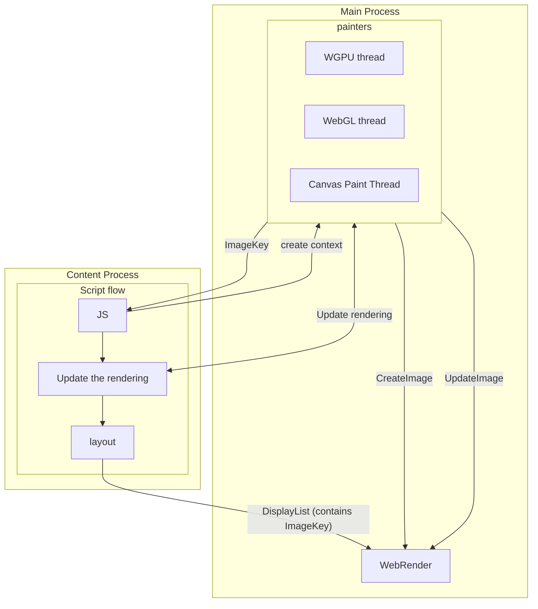
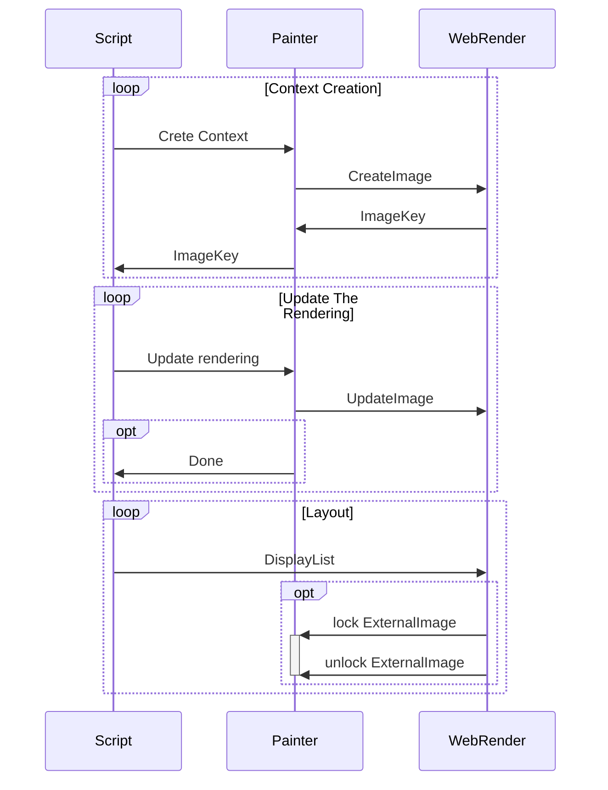
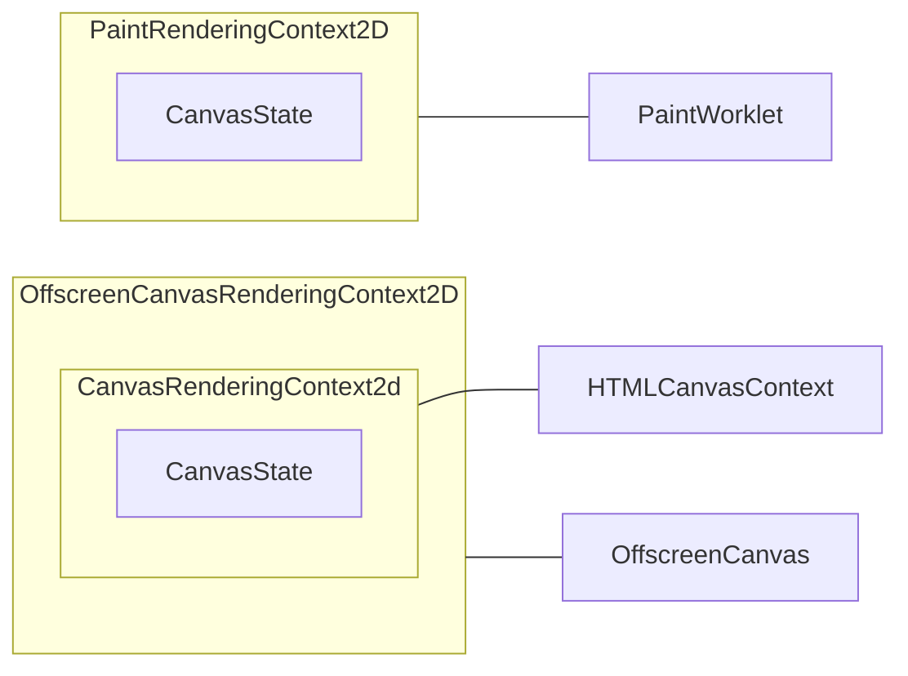
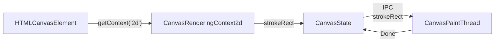
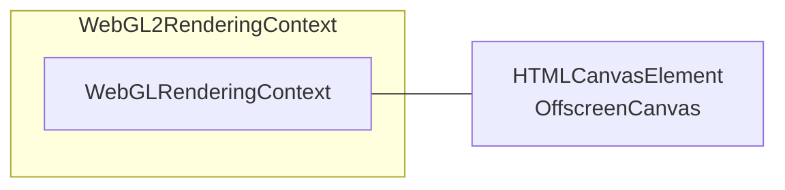
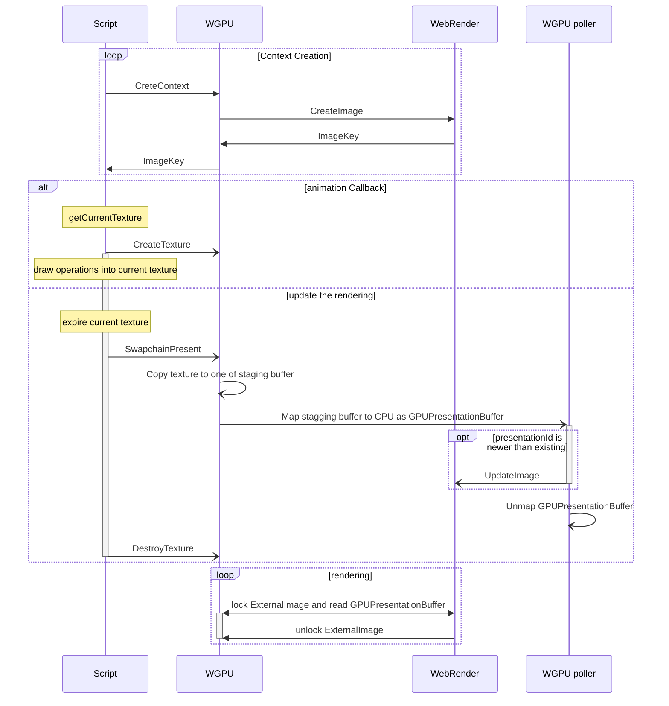
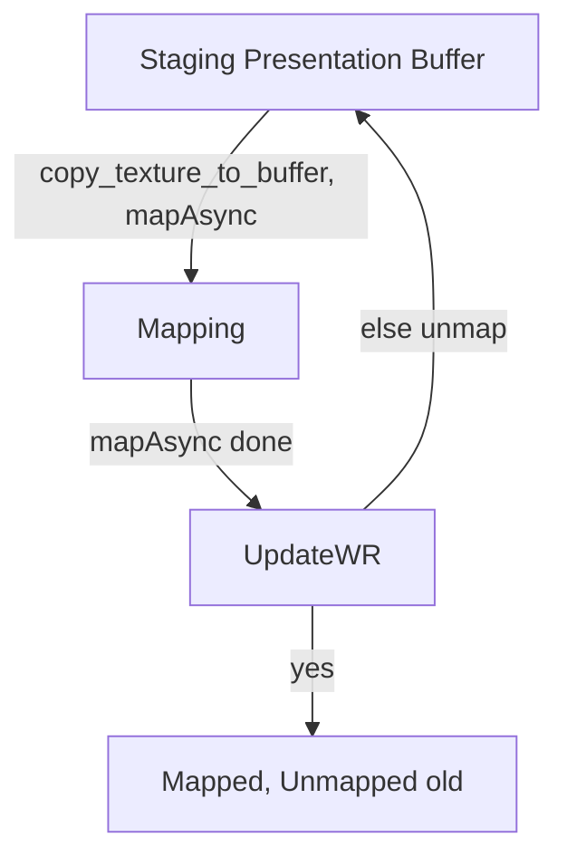

# Canvas

Servo supports all 4 types of canvas context:

- [`CanvasRenderingContext2D`](https://github.com/servo/servo/blob/3babf7498656b9ff41b9d7894849a1921c68f28f/components/script/dom/canvasrenderingcontext2d.rs#L41) (`2d` context)
- [`WebGLRenderingContext`](https://github.com/servo/servo/blob/3babf7498656b9ff41b9d7894849a1921c68f28f/components/script/dom/webglrenderingcontext.rs#L173) (`webgl` context)
- [`WebGL2RenderingContext`](https://github.com/servo/servo/blob/3babf7498656b9ff41b9d7894849a1921c68f28f/components/script/dom/webgl2renderingcontext.rs#L95) (`webgl2` context)
- [`GPUCanvasContext`](https://github.com/servo/servo/blob/3babf7498656b9ff41b9d7894849a1921c68f28f/components/script/dom/webgpu/gpucanvascontext.rs#L65) (`webgpu` context)

Each canvas context implements [`CanvasContext` trait](https://github.com/servo/servo/blob/4f8d816385a5837844a3986cda392bb6c0464fe6/components/script/canvas_context.rs#L26)
that requires context to implement some common features in unified way:

- `context_id`
- `resize` this method clears painters image by setting it to transparent alpha (all bytes are zero)
- `get_image_data` used obtaining canvas image, usually by calling `toDataUrl`, `toBlob`, `createImageBitmap` on canvas or indirectly by drawing one canvas in another
- `update_the_rendering` for triggering update of image (usually by swapping screen-buffer and back-buffer)
- `canvas` to obtain connected canvas element (this can be `HTMLCanvasElement` or `OffscreenCanvas`, which can also be connected to `HTMLCanvasElement` with context set to `placeholder`)

while also providing some good default implementations (`onscreen`, `origin_is_clean`, `size`, `mark_as_dirty`). `mark_as_dirty` is called from functions that affect painters image and tells layout to rerender canvas element (by marking `HTMLCanvasElement` as dirty node).

## HTML event loop and Rendering

As part of HTML event loop, script thread first run some JS as part of [perform-a-microtask-checkpoint](https://html.spec.whatwg.org/multipage/#perform-a-microtask-checkpoint)
(this runs all microtasks from queue such as loading script, event, callbacks).
After that [update-the-rendering](https://html.spec.whatwg.org/multipage/webappapis.html#update-the-rendering) is run,
that updates the rendering of onscreen canvases by requesting generation of new images from the painter threads.
Then it performs a microtask checkpoint again to [`run the animation frame callbacks`](https://html.spec.whatwg.org/multipage/imagebitmap-and-animations.html#run-the-animation-frame-callbacks).
Lastly it calls reflow that triggers (re)layout, which computes all styles into `DisplayList`,
that is sent to WebRender for rendering.

When canvas context creation is requested (`canvas.getContext('2d')`) we block script on painter thread to initialize
and create new WebRender image (`CreateImage`) with it's associated `ImageKey` that is sent to script thread.
Each canvas context implements [`LayoutCanvasRenderingContextHelpers`](https://github.com/servo/servo/blob/4f8d816385a5837844a3986cda392bb6c0464fe6/components/script/canvas_context.rs#L17),
that returns `ImageKey` (or `None` if canvas is cleared or otherwise not paintable due to large size)
that will be embedded into `DisplayList` as part of layout.
WebRender will read actual image data when rendering based on provided `ImageKey`.
In WebGL and WebGPU painters this is done by implementing custom `WebrenderExternalImageApi`,
that provides `lock`/`unlock` methods for WebRender to obtain actual image data,
while in 2D canvas image data is directly inserted on `CreateImage` and `UpdateImage`.

## 2D canvas context

While all other canvases uses same DOM object of context for onscreen/offscreen canvas, this is not the case for 2D canvas context due to it's long history. Web standards define 3 types of 2D canvas context:

- `CanvasRenderingContext2d` (connected to `HTMLCanvasContext`)
- `OffscreenCanvasRenderingContext2D` (connected to `OffscreenCanvas`)
- `PaintRenderingContext2D` (only available in `PaintWorklet`)

Both `CanvasRenderingContext2d` and `PaintRenderingContext2D` are implemented as wrappers around `CanvasState`, meanwhile  `OffscreenCanvasRenderingContext2D` is implemented as wrapper around `CanvasRenderingContext2d` because of similar logic to avoid duplication.

`CanvasState` implements actually logic of 2D drawing, or more exactly of setting appropriate state and sending IPC messages to Canvas Paint Thread (if needed as some commands that change state only get sent when there is actual draw command).

[All "dirty" 2d canvases are stored in `Document`](https://github.com/servo/servo/blob/4974b4a1f638041ad99f4050256b168748e77ea9/components/script/dom/document.rs#L489) and are [flushed on as part of reflow](https://github.com/servo/servo/blob/4974b4a1f638041ad99f4050256b168748e77ea9/components/script/dom/window.rs#L2196), by sending IPC message for redrawing of each canvas (this corresponds to update the rendering of canvas).

When drawing one 2D canvas in another 2D canvas we send special IPC message `DrawImageInOther` in order to avoid bitmap roundtrip (bitmap never leaves Canvas Paint Thread).

## WebGL canvas context

WebGL(2) canvas context is `WebGLRenderingContext` (or `WebGL2RenderingContext` which wraps and extends `WebGLRenderingContext`), that contain methods that stores state and sends IPC messages to WebGL thread, which executes actual OpenGL(ES) commands and return results via IPC. This is done in blocking manner (we await for WebGL thread to complete operation).

All ["dirty" webgl canvases are stored in `Document`](https://github.com/servo/servo/blob/c915bf05fc9abcfba8a64cd4d50166a363a61109/components/script/dom/document.rs#L494) and are flushed on as part of reflow,
by [sending one IPC message containing all dirty context ids](https://github.com/servo/servo/blob/c915bf05fc9abcfba8a64cd4d50166a363a61109/components/script/dom/document.rs#L3333),
then blocking on WebGL thread until that is done.
Flushing swaps framebuffer, where one is for presentation (that is read by WebRender) while other is used for drawing (is target of execution of GL commands).

## WebGPU canvas context

WebGPU presentation is the most special as it is fully async (non-blocking).
More info about how async is done in WebGPU can be read in [WebGPU chapter](./webgpu.md).

All onscreen WebGPU contexts gets [`update_the_rendering`](https://github.com/servo/servo/blob/c915bf05fc9abcfba8a64cd4d50166a363a61109/components/script/dom/webgpu/gpucanvascontext.rs#L261) executed as part of even loops "Update The Rendering".
This expires (destroys) current texture (in WebGPU, user draws into canvas texture obtainable via `gpu_canvas_context.getCurrentTexture()`),
but before that we do [SwapchainPresent](https://github.com/servo/servo/blob/c915bf05fc9abcfba8a64cd4d50166a363a61109/components/script/dom/webgpu/gpucanvascontext.rs#L189),
that copies texture data into one of 10 presentation GPU buffers.
After copying is done we async map new buffer to CPU. Because this process is async we mark each presentation buffer with incremented u64 id and only replace active presentation buffer if it's id is newer.
Unactive presentation buffer gets unmapped.

This is also modeled in TLA+: <https://gist.github.com/gterzian/aa5d96a89db280017b04917eee67f6ac>

Both WebRender's `lock` and `get_image_data` will use content of active mapped presentation buffer ([`GPUPresentationBuffer`](https://github.com/servo/servo/blob/c915bf05fc9abcfba8a64cd4d50166a363a61109/components/webgpu/swapchain.rs#L41)).

## Resources

- <https://medium.com/@polyglot_factotum/fixing-servos-event-loop-490c0fd74f8d>
- <https://github.com/servo/servo/issues/35733>
- <https://github.com/servo/servo/pull/33521>
- <https://github.com/servo/servo/pull/34631>
- <https://github.com/servo/servo/pull/33613>
- <https://github.com/servo/servo/issues/33368>
