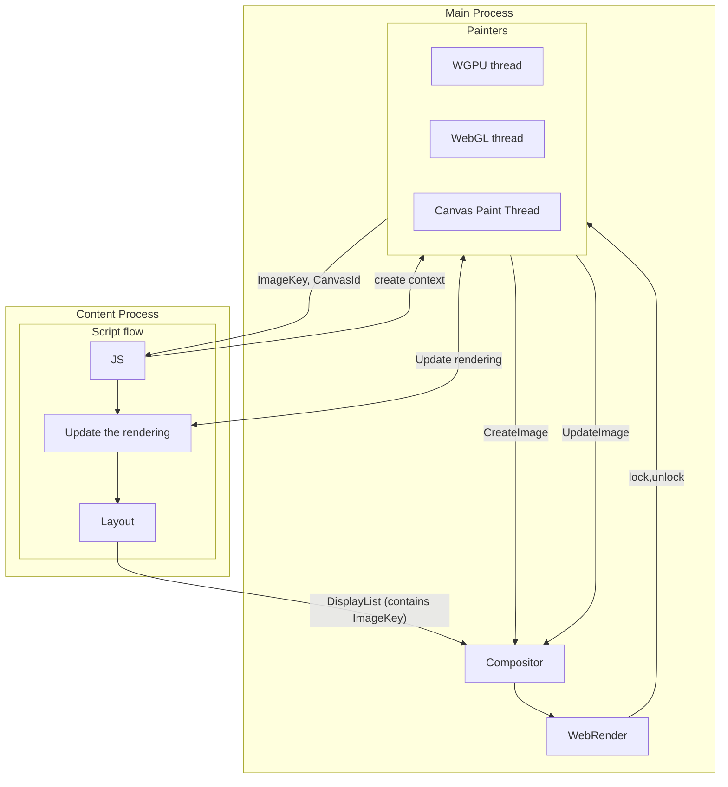
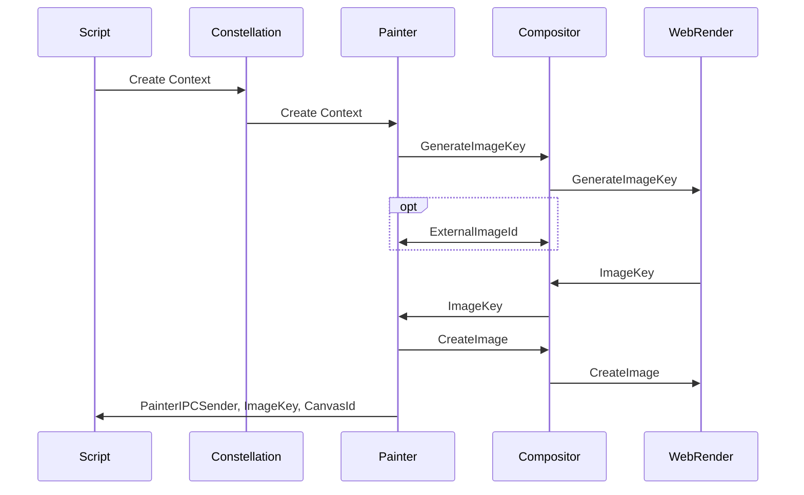
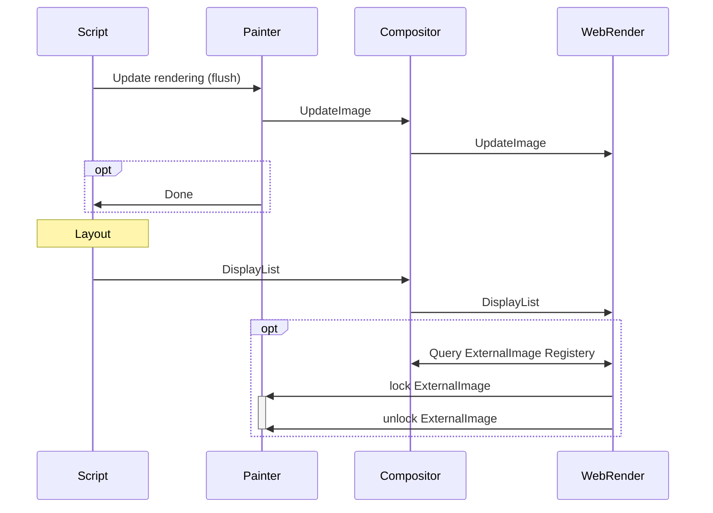

# Canvas

Servo supports four types of canvas context:

- [`CanvasRenderingContext2D`](https://github.com/servo/servo/blob/3babf7498656b9ff41b9d7894849a1921c68f28f/components/script/dom/canvasrenderingcontext2d.rs#L41) (`2d` context)
- [`WebGLRenderingContext`](https://github.com/servo/servo/blob/3babf7498656b9ff41b9d7894849a1921c68f28f/components/script/dom/webglrenderingcontext.rs#L173) (`webgl` context)
- [`WebGL2RenderingContext`](https://github.com/servo/servo/blob/3babf7498656b9ff41b9d7894849a1921c68f28f/components/script/dom/webgl2renderingcontext.rs#L95) (`webgl2` context)
- [`GPUCanvasContext`](https://github.com/servo/servo/blob/3babf7498656b9ff41b9d7894849a1921c68f28f/components/script/dom/webgpu/gpucanvascontext.rs#L65) (`webgpu` context)

Each canvas context implements the [`CanvasContext` trait](https://github.com/servo/servo/blob/4f8d816385a5837844a3986cda392bb6c0464fe6/components/script/canvas_context.rs#L26), which requires contexts to implement some common features in a unified way:

- `context_id`
- `resize`: this method clears the painter's image by setting it to transparent alpha (all bytes are zero)
- `get_image_data`: used when obtaining the canvas image, usually by calling `toDataUrl`, `toBlob`, `createImageBitmap` on the canvas or indirectly by drawing one canvas in another
- `update_the_rendering`: for triggering update of image (usually by swapping screen-buffer and back-buffer)
- `canvas`: obtain connected canvas element (this can be `HTMLCanvasElement` or `OffscreenCanvas`, which can also be connected to `HTMLCanvasElement` with context set to `placeholder`) while also providing some good default implementations (`onscreen`, `origin_is_clean`, `size`, `mark_as_dirty`). `mark_as_dirty` is called from functions that affect the painter's image and tells layout to rerender the canvas element (by marking `HTMLCanvasElement` as dirty node).

## HTML event loop and rendering

As part of HTML event loop, script thread runs a task (parsing, script evaluating, callbacks, events, ...) and after that it [performs a microtask checkpoint](https://html.spec.whatwg.org/multipage/#perform-a-microtask-checkpoint) that drains microtasks queue.
In [window event loop](https://html.spec.whatwg.org/multipage/webappapis.html#event-loop-processing-model:window-event-loop-3) we queue a global task to [updates the rendering](https://html.spec.whatwg.org/multipage/webappapis.html#update-the-rendering) if there is an [rendering opportunity](https://html.spec.whatwg.org/multipage/webappapis.html#rendering-opportunity) (usually driven by compositor based on hardware refresh rate).
In servo we do not actually queue a task, but instead we [run updates the rendering on any IPC messages in the ScriptThread](https://github.com/servo/servo/blob/d970584332a3761009f672f975bfffa917513b85/components/script/script_thread.rs#L1418) and [then perform a microtask checkpoint to as event loop would done after a task is completed](https://github.com/servo/servo/blob/d970584332a3761009f672f975bfffa917513b85/components/script/script_thread.rs#L1371).
[Updates the rendering](https://github.com/servo/servo/blob/d970584332a3761009f672f975bfffa917513b85/components/script/script_thread.rs#L1201) does various resize, scroll and animations steps (which also includes performing a microtask checkpoint; to resolve promises) and then [run the animation frame callbacks](https://html.spec.whatwg.org/multipage/imagebitmap-and-animations.html#run-the-animation-frame-callbacks) (callbacks added with [`requestAnimationFrame`](https://developer.mozilla.org/en-US/docs/Web/API/Window/requestAnimationFrame)).
Here draw commands are issued to painters to create new frame of animation.
Finally we triggers reflow (layout), which firstly updates the rendering of canvases (by flushing dirty canvases) and animated images which takes the DOM and its styles, builds a `DisplayList`, and sends that to WebRender for rendering.

When canvas context creation is requested (`canvas.getContext('2d')`), the script thread blocks on the painter thread, which initializes and creates a new WebRender image (`CreateImage`), then sends the associated `ImageKey` back to script.

Each canvas context implements [`LayoutCanvasRenderingContextHelpers`](https://github.com/servo/servo/blob/4f8d816385a5837844a3986cda392bb6c0464fe6/components/script/canvas_context.rs#L17), which returns the `ImageKey` that layout will use in its `DisplayList`, or `None` if the canvas is cleared or otherwise not paintable due to its size.
WebRender will read the resultant image data when rendering, based on the provided `ImageKey`.
In WebGL and WebGPU painters, this is done by implementing a custom `WebrenderExternalImageApi` that provides `lock` and `unlock` methods for WebRender to obtain the actual image data, while for 2D canvases, image data is directly provided via `CreateImage` and `UpdateImage`.

## 2D canvas context

While most canvases use the same DOM type for their onscreen and offscreen contexts, this is not the case for 2D canvases due to their long history.
Web standards define three types of 2D canvas context:

- `CanvasRenderingContext2D` (connected to `HTMLCanvasContext`)
- `OffscreenCanvasRenderingContext2D` (connected to `OffscreenCanvas`)
- `PaintRenderingContext2D` (only available in `PaintWorklet`)

`CanvasRenderingContext2D` and `PaintRenderingContext2D` are implemented as wrappers around `CanvasState`, while `OffscreenCanvasRenderingContext2D` is implemented as a wrapper around `CanvasRenderingContext2D` because of similar logic to avoid duplication.

`CanvasState` implements the actual logic of 2D drawing, by setting appropriate state and sending IPC messages to the Canvas Paint Thread.
Some commands only change internal state, but don’t need to send any messages until there is an actual draw command.

[All "dirty" 2d canvases are stored in `Document`](https://github.com/servo/servo/blob/4974b4a1f638041ad99f4050256b168748e77ea9/components/script/dom/document.rs#L489) and are [flushed during reflow](https://github.com/servo/servo/blob/4974b4a1f638041ad99f4050256b168748e77ea9/components/script/dom/window.rs#L2196), by sending IPC messages that trigger the `update_the_rendering` method on each canvas.

When drawing one 2D canvas into another 2D canvas, we send `DrawImageInOther`, a special IPC message that avoids copying the bitmap out of the canvas paint thread.

## WebGL canvas context

WebGL(2) canvas contexts are `WebGLRenderingContext` or `WebGL2RenderingContext`, and in Servo `WebGL2RenderingContext` wraps and extends `WebGLRenderingContext`.
These contexts store state and send IPC messages to the WebGL thread, which executes actual OpenGL (or OpenGL ES) commands and returns results via IPC.
The script thread blocks on the WebGL thread, waiting for each operation to complete.

All ["dirty" WebGL canvases are stored in `Document`](https://github.com/servo/servo/blob/c915bf05fc9abcfba8a64cd4d50166a363a61109/components/script/dom/document.rs#L494) and are flushed on as part of reflow, by [sending one IPC message containing all dirty context ids](https://github.com/servo/servo/blob/c915bf05fc9abcfba8a64cd4d50166a363a61109/components/script/dom/document.rs#L3333), then blocking on the WebGL thread until all canvases are flushed.
Flushing swaps the framebuffer, where one is for presentation (that is read by WebRender) while other is used for drawing (is target of execution of GL commands).

## WebGPU canvas context

WebGPU presentation is the most special as it is fully async (non-blocking).
More info about how async is done in WebGPU can be read in the [WebGPU chapter](./webgpu.md).

All onscreen WebGPU contexts have their [`update_the_rendering`](https://github.com/servo/servo/blob/c915bf05fc9abcfba8a64cd4d50166a363a61109/components/script/dom/webgpu/gpucanvascontext.rs#L261) executed as part of [updating the rendering](https://html.spec.whatwg.org/multipage/#update-the-rendering) in the HTML event loop.
This expires (destroys) the [current texture](https://developer.mozilla.org/en-US/docs/Web/API/GPUCanvasContext/getCurrentTexture), but before that we [send a SwapChainPresent request](https://github.com/servo/servo/blob/c915bf05fc9abcfba8a64cd4d50166a363a61109/components/script/dom/webgpu/gpucanvascontext.rs#L189), which copies texture data into one of 10 presentation buffers on the GPU.
After copying is done, we async map the new buffer to CPU.
Because this process is async, we mark each presentation buffer with an incrementing u64 id, and only replace the active presentation buffer if our buffer’s id is newer.
The inactive presentation buffer gets unmapped.

This is also modeled in TLA+: <https://gist.github.com/gterzian/aa5d96a89db280017b04917eee67f6ac>

Both WebRender's `lock` and `get_image_data` will use content of the [active presentation buffer](https://github.com/servo/servo/blob/c915bf05fc9abcfba8a64cd4d50166a363a61109/components/webgpu/swapchain.rs#L41).

## Resources

- <https://medium.com/@polyglot_factotum/fixing-servos-event-loop-490c0fd74f8d>
- [Update the rendering of canvas (#35733)](https://github.com/servo/servo/issues/35733)
- [webgpu: renovate gpucanvascontext and webgpu presentation to match the spec (#33521)](https://github.com/servo/servo/pull/33521)
- [webgpu: Fix HTML event loop integration (#34631)](https://github.com/servo/servo/pull/34631)
- [webgpu: Introduce PresentationId to ensure updates with newer presentation (#33613)](https://github.com/servo/servo/pull/33613)
- [webgpu: Make uploading data to wr with less copies (#33368)](https://github.com/servo/servo/issues/33368)
