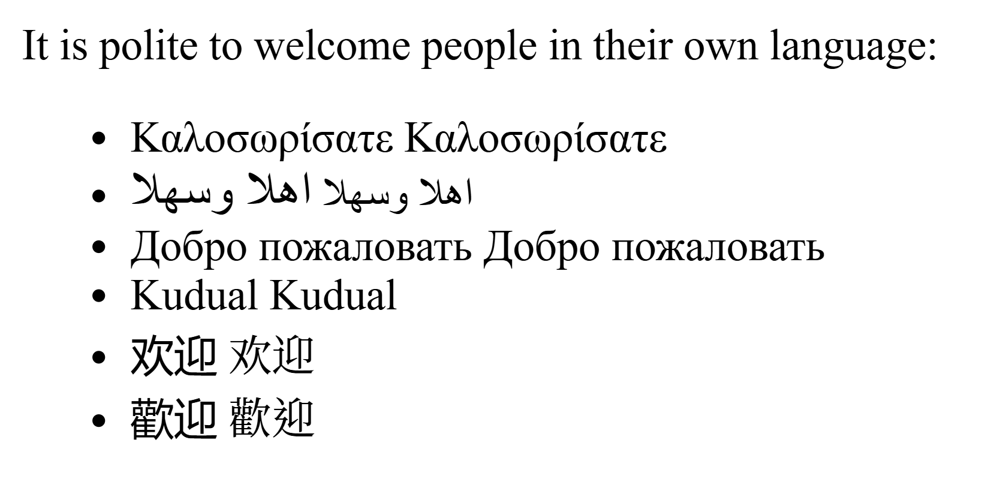

# Fonts
## Tasks of the `fonts` module in servo
- Provide interfaces for interaction with local and web fonts (part of the `@font-face` CSS at-rule implementation).
- Implement a mechanism to load web fonts from remote resources.
- Request the list of supported fonts from the platform.
- Provide RAM storage for all font resources.
- Supply all necessary data to `LayoutThread` including the sizes of individual glyphs and their positions on an infinite line. In other words, provide the `TextShaping` API.
- Deliver data for individual `glyph` rasterization to `WebRender`.
- Implement the `CSS font matching procedure`; For each available font face, create a dedicated `FontTemplateDescriptor` to be used in the `CSS font matching procedure`;
- Provide a unified font interface for the other components of the Servo engine
- Develop adapter (bridge) modules that connect platform-dependent font management libraries with the unified Servo interface

## Expanded servo architectural diagram
I think the easiest way to understand any complicated process is to create mental map with clear separation of the components.
On flowchart bellow I wanted to clarify interconnection between code objects and Threads & Processes to which they belong.


Lets highlite several important architectural details:
 - To avoid data duplication fonts loaded only once and managed by separate thread. That reduces memory footprint of the program. Another reason is limitations that particular platform typesetting library stack imposes on servo(I.E threadsafety of function calls)
 - Special IPC mechanism that serve as middleman between Script and Compositor threads (processes) provided;

## Fonts sequence diagram
Lets also analyze how servo initializes cause it is important to understand when fonts is loaded in general pipeline. Sequence diagram bellom demonstrate how significant number of servo threads will be launched.

As you can see in the current architecture we start with `embedder` (main thread in servo process on current platform) that will initialize `Constellation` thread with `create_constellation` call. `Constellation` in order will start `SystemFontService`. On startup `SystemFontService` will execute `refresh_local_families` function that will call `for_each_available_family` and `for_each_variation` functions from pltaform dependent `FontList` realization. On this step we do not create `FontFace` objects, we just get information from platform regarding `FontTemplateDescriptors` that will be used used by `Script Thread` during the procedure of `Font Style Matching`.

### Font Style matching
The algorithm itself is quite large and could be found on the following link:
https://www.w3.org/TR/css-fonts-4/#font-matching-algorithm


#### Place of font matching in servo pipeline
On `InlineFormattingContext` construction (`IFC` do not confuse with `IndependentFromattingContext` that sometimes get simmilar abbreviation) we will traverse all accumulated text within single IFC and perform `Text segmentation` required by shaping libraries (i.e. HarfBuzz). During this procedure we divide infinite string into smaller segments. Each segment must have four properties that is shared by all unicode characters within the segment. (Add link to inline layout)

##### Text segmentation features
 - Bidi direction
 - Language
 - Script
 - ***Font*** (particular rigidly defined face within the font)

As you can see choice of the font of particular character is important preparation to further Layout.

As a result of this algorthm we must get the `FontFace` of particular font file that will be used to draw character in question. Lets determine what inputs do we have that affect the algorithm.
#### Font Style matching inputs
1. CSS style of inline or block element of current codepoint; Change of any property bellow may generate new used FontFace
    - font-family
    - font-size
    - font-style
    - font-weight
    - font-stretch
    - x-lang (:lang() selector)

2. OS / font-library provided information about font propperties (Localized name / variations / character support / e.t.c);

#### Font Style matching implementation
Most important places in code for us, is a piece of code text-segmentation algorithm that choses font, that could be found at:
`components\layout_2020\flow\inline\text_run.rs` `TextRun::segment_and_shape` `TextRun::segment_text_by_font`

The following function setup important concept of FontGroup. Each Font-group is associated with particular style of parent element, this is the optimization that allow to reuse determined fonts within the group to the elements with the same style that we can meet further down the processing of web-page. This allows to traverse less fonts per call of `find_by_codepoint` function that contains steps 1, 2, 3, 5, 6, 7, 8 of CSS Font Style Matching.

```rust
fn segment_text_by_font(
        &mut self,
        formatting_context_text: &str,
        font_context: &FontContext,
        font_cache: &mut Vec<FontKeyAndMetrics>,
        bidi_info: &BidiInfo,
    ) -> Vec<(TextRunSegment, FontRef)> {
        let font_group = font_context.font_group(self.parent_style.clone_font());
        ...
        for (character, next_character) in char_iterator {
            ...
            let Some(font) = font_group.write().find_by_codepoint(
                font_context,
                character,
                next_character,
                current_font,
            ) else {
                continue;
            };
            ...
        }
    }
```

I tried to make `find_by_codepoint` function as self explanotory as possible in: PR
https://github.com/servo/servo/pull/35696

But I don't know whether it will be accepted so I will explain important concepts here. First that everyone must understand, on first call `FontGroup` object is kinda empty. It contains only the names of fonts from `font-family` CSS property in the form of `SmallVec<[FontGroupFamily; 8]>`, `language_id` of current element and special `FontDescriptor` created from CSS-styles.

Each `FontGroupFamily` represent `FontFamily` that may be represented on device as single font file or a set of font-files if we consider `segmented fonts`. Each `FontFamily` (`FontGroupFamily`) must have set of `FontDescriptor`s that allow to uniquely identify `FontFace` object within particular `font file`.

That means that `FontGroup::FontDescriptor` represents some abstract `FontFace` that must be present in at least one of `FontFamily` objects. In case we will not be able to find it we will start `installed_font_fallback` procedure;

`Language_id` is the new CSS4 feature that allow us to more accurately control visual representation. Lets say we have two `FontFamily` within specified list which have `FontFace` that will satisfy `FontGroup::FontDescriptor`. In that case old spec asked us to simply pick first one that satisfies the descriptor. CSS4 allows user to setup corresondance between language of the element and particular family that we want to use:
```html
<!doctype html>
<meta charset="utf-8">
<title>Modified demonstration of language based font matching</title>
<link rel="author" title="Andrew Cunningham, State Library of Victoria" href="https://www.w3.org/International/questions/qa-css-lang">
<link rel="author" title="Richard Ishida, W3C" href="https://www.w3.org/International/questions/qa-css-lang">
<link rel="author" title="Desiatkin Dmitrii" href="https://github.com/d-desiatkin">
<style>
body 		{font-family: "Times New Roman" "Kai", "KaiTi", "DFKai-SB", "BiauKai", serif;}
:lang(zh-Hant) 	{font-family: Kai,KaiTi,serif;}
:lang(zh-Hans) 	{font-family: DFKai-SB,BiauKai,serif;}
</style>
<div>
<p>It is polite to welcome people in their own language:</p>
<ul>
    <li>歡迎 欢迎 <span lang="zh-Hans">欢迎</span></li>
    <li>欢迎 歡迎 <span lang="zh-Hant">歡迎<span></li>
</ul>
</div>
```

On pictures above you can see that body have several conflicting font-families all of them are capable to display particular character. Language allow us to additionaly precisely chose `FontGroupFamily` within `FontGroup`

So the task of `find_by_codepoint` is:
1. Traverse all `font files` that represent particular `FontFamily` on device, and accumulate all possible `FontFace`s within family in question. Get `FontFace`s in form the of list of `FontDescriptor`s (load with help o OS / font third party libraries).
2. Traverse each `FontGroupFamily` in `FontGroup`, and check whether particular `FontDescriptor` within `FontGroupFamily` supports current character (this `FontFace` have visual representation of the character).
Filter out all `FontDescriptor` within `FontGroupFamily`, and potentially `FontGroupFamilies` that is unable to provide adequate support for current character;
3. Perform font-matching within font-group as described in the spec.
4. If we was not able to find any suitable `FontGroupFamily::FontDescriptor` we start `installed font fallback` procedure (searching within full list font files that platform provides). Particular implementation is platform specific.
5. If we still was unable to find any `FontFace` within all `font files` on platform. Setup special `Last Resort` font family as font for current character.

```rust
pub fn find_by_codepoint(
        &mut self,
        font_context: &FontContext,
        codepoint: char,
        next_codepoint: Option<char>,
        first_fallback: Option<FontRef>,
    ) -> Option<FontRef> {
        ...
    }
```


## Interesting Facts
The first fonts emerged alongside the invention of movable type and printing press machines. It is difficult to determine exactly which font was the very first ever created, but one essential factor that defines a set of characters as a font is the durability of its printing surfaces. Therefore, the earliest consistent font likely appeared with the development of metal type as a printing surface.
Looking at Chinese sources, the earliest font ever created was likely the movable metal type that emerged during the Song Dynasty [[1]](https://en.wikipedia.org/wiki/History_of_printing_in_East_Asia#cite_note-5). Meanwhile, European sources indicate that one of the most widely used early fonts in Europe was developed by Johannes Gutenberg in 1439 [[2]](https://en.wikipedia.org/wiki/Movable_type). The famous Gutenberg Bible [[3]](https://en.wikipedia.org/wiki/Gutenberg_Bible) was printed using this font, which became known after its creator. To learn more, simply search for the `Gutenberg` font online.

### Digital Font Representation
Given fonts long history of evolution, it’s no surprise that digital technologies have rapidly advanced their development. The way fonts are represented in digital formats has changed dramatically over the last 60 years. Modern computer systems use various methods to represent characters within font files, including:
- bitmaps
- outline (vector)
- signed distance field [(SDF)](https://github.com/ShoYamanishi/SDFont) and multi-channel signed distance field [(MSDF)](https://github.com/Chlumsky/msdfgen)
- set of simple forms or draw commands [[4]](https://www.merl.com/publications/docs/TR2006-119.pdf)[[5]](https://ronaldperry.org/SaffronTechDocs/SSF_2006_SIGRRAPH.pdf); simple forms may be one of the following:
    - Component Reuse - Parts of character as outlines
    - Pen-based representations
    - Uniform stroke representations
    - Stylized Stroke Fonts


