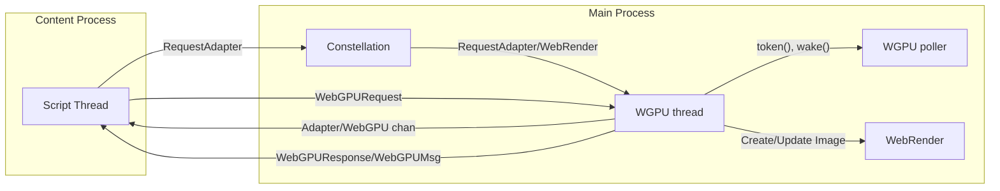

# WebGPU

WebGPU implementation is powered by [wgpu(-core)](https://github.com/gfx-rs/wgpu).

## Architecture

Servo's WebGPU implementation is composed of two parts:

- DOM implementation
- WGPU implementation

### DOM implementation

DOM implementation lives in [`components/script/dom/webgpu`](https://github.com/servo/servo/tree/main/components/script/dom/webgpu) and implements JS interfaces defined in [WebGPU IDL](https://github.com/servo/servo/blob/main/components/script_bindings/webidls/WebGPU.webidl) that are exposed in browser's JS.

Here we only implemented logic that is [described in spec under content timeline](https://www.w3.org/TR/webgpu/#content-timeline), which is mostly just converting JS to wgpu-types descriptors that are sent to WGPU thread via IPC messages that are defined in <https://github.com/servo/servo/blob/main/components/webgpu/ipc_messages/recv.rs>
WebGPU is async by design, so there is no need to wait for WGPU thread operation to finish.
This is done by storing ids in DOM WebGPU objects that links to WGPU objects that live in WGPU thread (are provided by wgpu-core). More information about this design is available in wgpu repo: <https://github.com/gfx-rs/wgpu/blob/2764e7a39920e23928d300e8856a672f1952da63/wgpu-core/src/hub.rs#L30>.

### WGPU implementation

Actual processing is done in separate thread (and separate process - Main Process): [`WGPU`](https://github.com/servo/servo/blob/main/components/webgpu/wgpu_thread.rs) and [`WGPU poller`](https://github.com/servo/servo/blob/main/components/webgpu/poll_thread.rs) thread that are started lazily on first request of adapter.

WGPU thread handles incoming IPC messages from script and dispatches appropriate wgpu-core functions, that implement steps defined in [device timeline](https://www.w3.org/TR/webgpu/#device-timeline).
Some calls also wake WGPU poller thread, which effectively runs [queue timeline](https://www.w3.org/TR/webgpu/#queue-timeline) by calling `poll_all_devices` from wgpu-core.

## Updating WebGPU CTS expectations

WebGPU CTS expectations are enormous, so instead of `mach update-wpt` we use [`moz-webgpu-cts`](https://github.com/erichdongubler-mozilla/moz-webgpu-cts) to update expectations (actually we use forked version <https://github.com/sagudev/moz-webgpu-cts/tree/servo>).

For updating expectations, you need to obtain wptreport of test, either by triggering full CTS run in CI via `mach try webgpu` or by running specific tests locally `mach test-wpt -r --log-wptreport r.json {{tests}}`.
Do note that expectations are set for release/productions build as debug builds are to slow.
Then use `moz-webgpu-cts --servo process-reports --preset set r.json` to set expectations for reported test results.

Sometimes is also useful to test live CTS by running: `mach run -r --pref dom.webgpu.enabled "https://gpuweb.github.io/cts/standalone/?runnow=1&q={{test}}"`

## Working on upstream gfx-rs/wgpu

Servo can also be used to test wgpu changes against [CTS](https://gpuweb.github.io/cts/) using the following steps:

1. Update wgpu in servo to latest commit (optional, but recommended if servo's version is old)
2. Base wgpu work on same wgpu commit servo uses
3. Updating wgpu in servo's `Cargo.toml` to new wgpu changes
4. Test changes by triggering full CTS run via: `mach try webgpu`
5. Link results to wgpu PR

## More Resources

- [A walk through the implementation of WebGPU in Servo](https://servo.org/blog/2020/08/30/gsoc-webgpu/)
