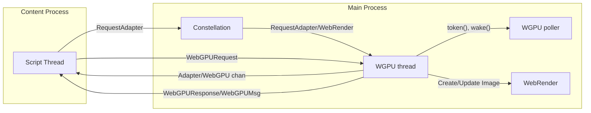

# WebGPU

Servo’s WebGPU implementation is powered by [wgpu(-core)](https://github.com/gfx-rs/wgpu), and is composed of two parts:

- DOM implementation
- WGPU implementation



### DOM implementation

DOM implementation lives in [`components/script/dom/webgpu`](https://github.com/servo/servo/tree/main/components/script/dom/webgpu), implementing JS interfaces defined in [WebGPU IDL](https://github.com/servo/servo/blob/main/components/script_bindings/webidls/WebGPU.webidl) that are exposed to the web platform.

Here we only implement logic that is described in the WebGPU spec under the [*content timeline*](https://www.w3.org/TR/webgpu/#content-timeline).
This mostly involves converting JS types to wgpu-types descriptors that are sent to WGPU thread via IPC messages that are defined in <https://github.com/servo/servo/blob/main/components/webgpu/ipc_messages/recv.rs>.
WebGPU is async by design, so there is no need to wait for WGPU thread operations to finish.
This is done by storing ids in DOM WebGPU objects that link to WGPU objects that live in the WGPU thread (are provided by wgpu-core).
More information about this design is available [in the wgpu repo](https://github.com/gfx-rs/wgpu/blob/2764e7a39920e23928d300e8856a672f1952da63/wgpu-core/src/hub.rs#L30).

### WGPU implementation

Actual processing is done in two dedicated threads of the main browser process: one for [`WGPU`](https://github.com/servo/servo/blob/main/components/webgpu/wgpu_thread.rs), and one for the [WGPU poller](https://github.com/servo/servo/blob/main/components/webgpu/poll_thread.rs).
These threads are started lazily on the first request for an adapter.

The WGPU thread implements steps defined in the [*device timeline*](https://www.w3.org/TR/webgpu/#device-timeline), by dispatching wgpu-core functions in response to incoming IPC messages from script.
Some calls also wake the WGPU poller thread, which effectively runs the [*queue timeline*](https://www.w3.org/TR/webgpu/#queue-timeline) by calling `poll_all_devices` from wgpu-core.

## Updating WebGPU CTS expectations

WebGPU CTS expectations are enormous, so instead of `mach update-wpt` we use [a fork](https://github.com/sagudev/moz-webgpu-cts/tree/servo) of [`moz-webgpu-cts`](https://github.com/erichdongubler-mozilla/moz-webgpu-cts) to update expectations.

To update expectations, you need to obtain the `wptreport` log for the run, either by triggering a full CTS run in CI (`mach try webgpu`) or by running specific tests locally:

```sh
$ mach test-wpt -r --log-wptreport report.json [tests ...]
```

Note that expectations are set for release/productions builds as debug builds are too slow.
Then update expectations as follows:

```sh
$ moz-webgpu-cts --servo process-reports --preset set report.json
```

You can also test Servo against [the live CTS](https://gpuweb.github.io/cts/standalone/):

```sh
$ mach run -r --pref dom.webgpu.enabled 'https://gpuweb.github.io/cts/standalone/?runnow=1&q=<test>'
```

## Working on upstream [gfx-rs/wgpu](https://github.com/gfx-rs/wgpu)

Servo can be used to test wgpu changes against the [WebGPU CTS](https://gpuweb.github.io/cts/) as follows:

1. Update wgpu in Servo’s Cargo.toml to the latest commit (optional, but recommended if Servo is out of date)
2. Base your wgpu changes on the same wgpu commit used by Servo
3. Update wgpu in Servo's Cargo.toml to the branch with your changes
4. Test your changes by triggering a full CTS run: `mach try webgpu`
5. Include a link to the test results in your wgpu pull request

## More resources

- [A walkthrough of how WebGPU was first implemented in Servo](https://servo.org/blog/2020/08/30/gsoc-webgpu/)
