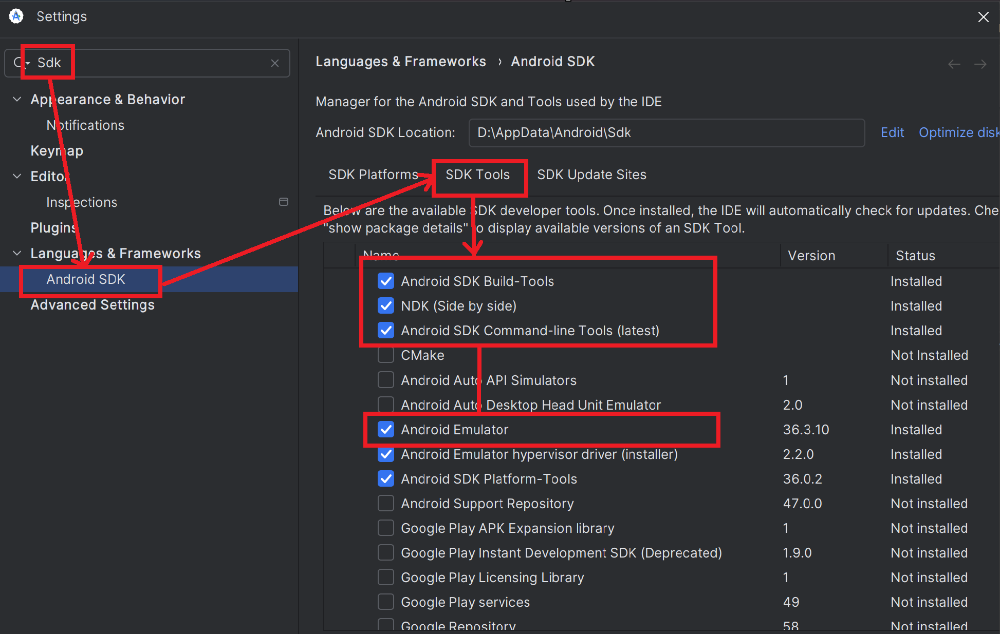
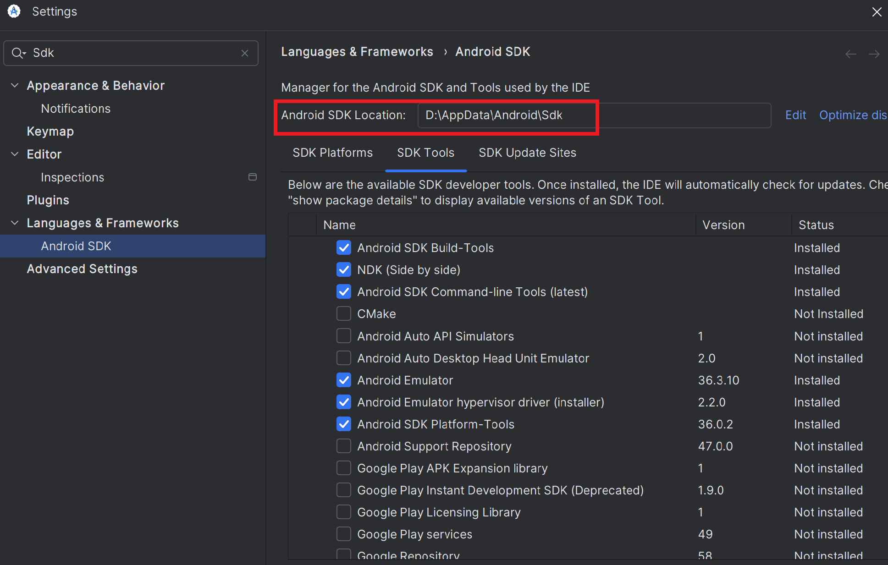
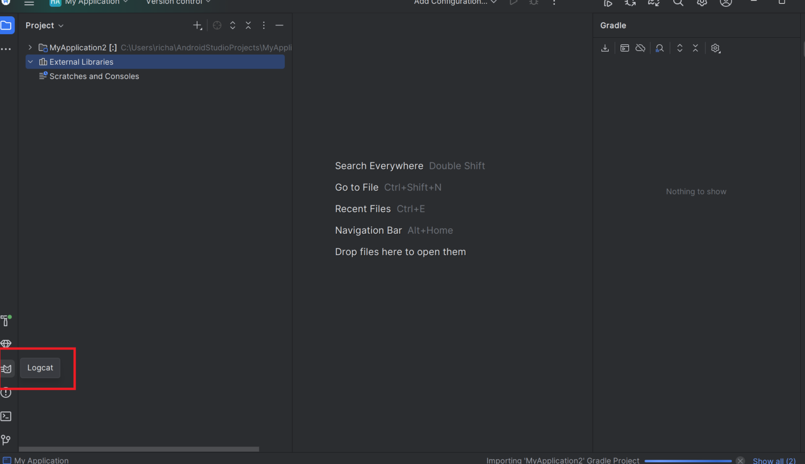

# Building for Android (CLI)

- Ensure that the following environment variables are set:
  - `ANDROID_SDK_ROOT`
  - `ANDROID_NDK_ROOT`: `$ANDROID_SDK_ROOT/ndk/28.2.13676358/`
 `ANDROID_SDK_ROOT` can be any directory (such as `~/android-sdk`).
  All of the Android build dependencies will be installed there.
- Install the latest version of the [Android command-line tools](https://developer.android.com/studio#command-tools) to `$ANDROID_SDK_ROOT/cmdline-tools/latest`.
- Run the following command to install the necessary components:
  ```shell
  sudo $ANDROID_SDK_ROOT/cmdline-tools/latest/bin/sdkmanager --install \
   "build-tools;34.0.0" \
   "emulator" \
   "ndk;28.2.13676358" \
   "platform-tools" \
   "platforms;android-33" \
   "system-images;android-33;google_apis;arm64-v8a"
  ```
- Run `./mach build --android -r`

**Note**: This will install dependencies and build Servo for the `aarch64-linux-android` platform.
In order to build Servo for other Android targets, ensure that you install the appropriate system images via `sdkmanager` and pass `--target` with a Rust compatible target to `mach` when building instead of `--android`.

**Note**: It's also possible to use an installation from [Android Studio](https://developer.android.com/studio).
Just ensure that the `ANDROID_SDK_ROOT` and `ANDROID_NDK_ROOT` variables are set properly.

**Note**: If you are not using Android Studio on macOS, you will need to install a JDK.
Use `brew install opendjdk@21` to install a usable version; newer versions cause `java.lang.IllegalArgumentException: 25` when running the gradle build step during the Servo build.

**Note**: If you are using Nix, you don't need to install the tools or set up the ANDROID_* environment variables manually.
Simply enable the Android build support running:

```
export SERVO_ANDROID_BUILD=1
```

in the shell session before invoking ./mach commands

## Running in the emulator

1. Create a new AVD image to run Servo:
    ```
    $ANDROID_SDK_ROOT/cmdline-tools/latest/bin/avdmanager create avd \
        --name "Servo" \
        --device "pixel" \
        --package "system-images;android-33;google_apis;arm64-v8a" \
        --tag "google_apis" \
        --abi "arm64-v8a"
    ```
2. Enable the hardware keyboard.
   Open `~/.android/avd/Servo.avd/config.ini` and change `hw.keyboard = no` to `hw.keyboard = yes`.
3. Launch the emulator
   ```
   $ANDROID_SDK_ROOT/emulator/emulator -avd servo -netdelay none -no-snapshot
   ```
4. Install Servo on the emulator:
   ```
    ./mach install -r --android
   ```
5. Start Servo by tapping the Servo icon on your launcher screen.

## Installing on a physical device

1. [Set up your device for development](https://developer.android.com/studio/run/device).
2. Build Servo as described above, ensuring that you are building for the appropriate target for your device.
3. Install Servo to your device by running:
   ```
   ./mach install -r --android
   ```
4. Start Servo by tapping the Servo icon on your launcher screen or run:
   ```
   ./mach run --android https://www.servo.org/
   ```

You can request a force-stop of Servo by running:
```
adb shell am force-stop org.servo.servoshell/org.servo.servoshell.MainActivity
```

If the above doesn't work, try this:
```
adb shell am force-stop org.servo.servoshell
```

You can uninstall Servo by running:
```
adb uninstall org.servo.servoshell
```

---

# Building for Android (GUI)
For beginners, it is recommended to use this approach. Note that at present, cross compilation is not supported on Windows platform.

This tutorial will only cover building for Android on a Linux platform, although the process should be relatively similar for MacOS.

### Installing Android Studio
Download the tarball from the [official website](https://developer.android.com/). Next, run the following commands on bash:

```bash
cd /DOWNLOAD_PATH
tar -xvf android-studio-xxx-linux.tar.gz
```

To run Android Studio: 

```bash
cd /PATH_TO_ANDROID_STUDIO_DIRECTORY/android-studio/bin
./studio
```

### Installing additional tools
To install the necessary tools, run Android Studio and go to `settings` and type `sdk` on the search bar. 

Next, click `Android SDK` and navigate to `SDK Tools` and install the following:


Then click `Ok`.

Lastly, install `JDK`. On an `apt`-based distributions:

```bash
apt install default-jdk
```

### Setting up necessary environment variables
There are two variables to be set, `ANDROID_SDK_ROOT` and `ANDROID_NDK_ROOT`.

For `ANDROID_SDK_ROOT`, set the following as follows:


**Note**: Some may notice that the path above is Windows'. This is because the screenshot was taken on a Windows machine. This, however, does not mean that building for Android on Windows is currently possible.

For `ANDROID_NDK_ROOT`:
```bash
$ANDROID_SDK_ROOT/ndk/28.2.13676358/
```

### Building Servo
To build, simply run `./mach build --android -r` for release version, or `./mach build --android -d` for debug version.

### Running Servo (on emulator)
1. Create a new AVD image to run Servo:
    ```
    $ANDROID_SDK_ROOT/cmdline-tools/latest/bin/avdmanager create avd \
        --name "Servo" \
        --device "pixel" \
        --package "system-images;android-33;google_apis;arm64-v8a" \
        --tag "google_apis" \
        --abi "arm64-v8a"
    ```
2. Enable the hardware keyboard.
   Open `~/.android/avd/Servo.avd/config.ini` and change `hw.keyboard = no` to `hw.keyboard = yes`.
3. Launch the emulator
   ```
   $ANDROID_SDK_ROOT/emulator/emulator -avd servo -netdelay none -no-snapshot
   ```
4. Install Servo on the emulator:
   ```
    ./mach install -r --android
   ```
5. Start Servo by tapping the Servo icon on your launcher screen.

**Note**: Unless your host machine is ARM-based (such as newer Macbooks with Apple Silicon), it is impossible to run Servo on an emulator.

### Running Servo (on physical device)
To run, first enable `USB debugging` for your Android device and then run `./mach run --android -r`.

### Extra note: Logging
1. Add `println!()` to any part of the code you wish to debug.
2. Compile with `./mach build --android -d`.
3. Run `./mach run --android -d`.
4. On Android Studio, create a dummy project to open `logcat`:


## Troubleshooting 

Be sure to look at the [General Troubleshooting](general-troubleshooting.md) section if you have trouble with your build.
