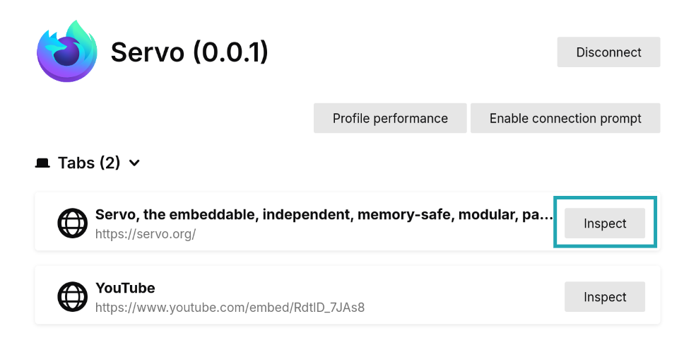
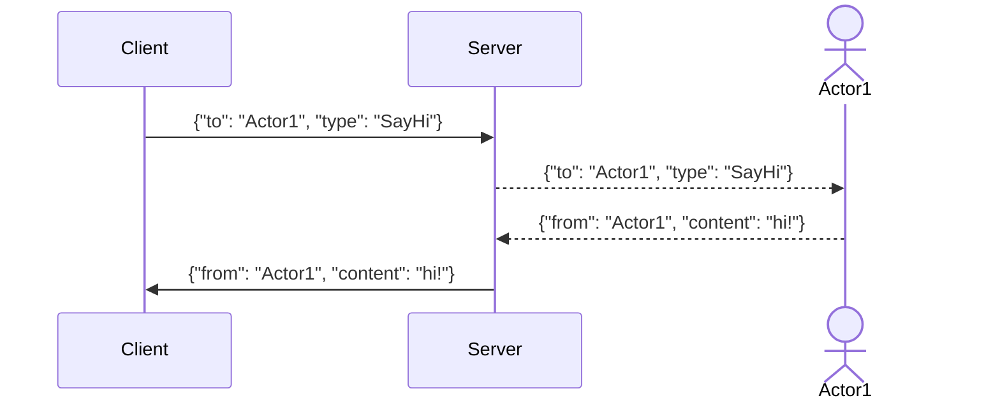

# Devtools

[Firefox DevTools](https://firefox-source-docs.mozilla.org/devtools-user) are a set of web developer tools that can be used to examine, edit, and debug a website's HTML, CSS, and JavaScript.
Servo has support for a subset of DevTools functionality, allowing for simple debugging.

## Connecting to Servo

1. Run servoshell with the DevTools server enabled.
   The number after the `devtools` parameter is the port used by the server.

```sh
./mach run --devtools=6080
```

2. Open Firefox and go to `about:debugging`.
   If this is your first time using the DevTools integration, go to **Setup** and add `localhost:6080` as a [network location](https://firefox-source-docs.mozilla.org/devtools-user/about_colon_debugging/index.html#connecting-over-the-network).
   The port number must be the same as in the previous step.

3. Click on **Connect** in the sidebar next to `localhost:6080`.


4. Back in Firefox, choose a webview and click **Inspect**.
   A new window should open with the page's inspector.



## Using the inspector

The inspector window is divided in various tabs with different workspaces.
At the moment, **Inspector** and **Console** are working.

In the **Inspector** tab there are three columns.
From left to right:

- The **HTML tree** shows the document nodes.
  This allows you to see, add, or modify attributes by double-clicking on the tag name or attribute.
- The **style inspector** displays the CSS styles associated with the selected element.
  The entries here come from the element's style attribute, from matching stylesheet rules, or inherited from other elements.
  Styles can be added or modified by clicking on a selector or property, or clicking in the empty space below.
- The **extra column** contains more helpful tools:
  - **Layout** contains information about the box model properties of the element.
    Note that flex and grid do not work yet.
  - **Computed**, which contains all the CSS [computed values](https://drafts.csswg.org/css-cascade/#computed) after resolving things like relative units.


The **Console** tab contains a JavaScript console that interfaces with the website being displayed in Servo.
Errors, warnings, and information that the website produces will be logged here.
It can also be used to run JavaScript code directly on the website, for example, changing the document content or reloading the page:

```js
document.write("Hello, Servo!")
location.reload()
```

<div class="warning">

Support for DevTools features is still a work in progress, and it can break in future versions of Firefox if there are changes to the messaging protocol.
</div>

## Developing DevTools

Read the complete [protocol description](https://firefox-source-docs.mozilla.org/devtools/backend/protocol.html) for an in-depth look at all of the important concepts.

- **Client:** Frontend that contains different tooling panels (Inspector, Debugger, Console, ...) and sends requests to the server.
  At the moment this is the `about:debugging` page in Firefox.
- **Server:** Browser that is being inspected by the client. Receives messages and delivers them to the appropiate actor so it can reply.
- **Actor:** Code on the server that can exchange messages with the client.
- **Message:** JSON packet that is exchanged between the server and the client.
  - Messages from the client must include a `to` field with the name of the actor they are directed to, and a `type` field specifying what sort of packet it is.
  - Messages from the server must include a `from` field with the name of the actor that sends them.



### Displaying protocol traffic

<div class="warning _note">

Jump to the [Capturing and processing protocol traffic](#capturing-and-processing-protocol-traffic) section for a more useful tool for log analysis.
</div>

#### Servo ↔ Firefox

Servo can show the messages sent and received from the DevTools server.
Enable the correct loging level for `devtools` and you are set:

```sh
RUST_LOG="error,devtools=debug" ./mach run --devtools=6080
```

The output has messages sent (prefixed by `<-`) and messages received (no prefix).
Here we can see how Servo sends the initial connection information and Firefox replies with a request to connect and its version number.

```
[2025-11-07T11:37:35Z INFO  devtools] Connection established to 127.0.0.1:47496
[2025-11-07T11:37:35Z DEBUG devtools::protocol] <- {"from":"root","applicationType":"browser","traits":{"sources":false,"highlightable":true,"customHighlighters":true,"networkMonitor":true}}
[2025-11-07T11:37:35Z DEBUG devtools::protocol] {"type":"connect","frontendVersion":"144.0.2","to":"root"}
[2025-11-07T11:37:35Z DEBUG devtools::protocol] <- {"from":"root"}
```

#### Firefox ↔ Firefox

A lot of work to improve developer tool support in Servo requires **reverse-engineering** the working implementation in Firefox.
One of the most efficient ways to do this is to observe a successful session in Firefox and record the bidirectional protocol traffic between the server and the client.

<div class="warning _note">

**On the first run**

1. Create a new Firefox profile using `firefox --createprofile devtools-testing`.
1. Launch Firefox with `firefox --new-instance -P devtools-testing`.
1. Open about:config and click on "Accept the Risk and Continue".
1. Change the following configuration:

```sh
# To see logs in the terminal window
browser.dom.window.dump.enabled = true
devtools.debugger.log = true
devtools.debugger.log.verbose = true
# To enable debugging
devtools.chrome.enabled = true
devtools.debugger.remote-enabled = true
# Optional, avoids having to confirm every time there is a connection
devtools.debugger.prompt-connection = false
```
</div>

After Firefox is configured, it can be launched from the terminal starting the DevTools server:

```sh
firefox --new-instance --start-debugger-server 6080 -P devtools-testing
# (on macOS you may need `/Applications/Firefox.app/Contents/MacOS/firefox`)
```

In this case it is possible to use the same Firefox instance as a client and a server. However, it is not recommended to use "This Firefox", as that doesn't give you access to tabs and messages could be different.
Instead, whether you are using the same or a different instance, follow the steps outlined in the [Connecting to Servo](#connecting-to-servo) section, skipping the first one.

The terminal window now contains full debug server logs; copy them to somewhere for further analysis.

### Capturing and processing protocol traffic

We have seen a simple way of obtaining message logs from Servo and Firefox.
However, this soon turns complex when wanting to compare logs between the two due to the different formats or performing queries on them.
There is a small script to make this process easier: [`etc/devtools_parser.py`](https://github.com/servo/servo/blob/main/etc/devtools_parser.py).

It is based on [Wireshark](https://www.wireshark.org/), a powerful network packet analyzer; more specifically its cli, `tshark`.
It is configured to log packets sent on your local network on the port that the DevTools server is running.
It can read the payloads from these packets, which are small bits of the JSON DevTools protocol.

**`tshark` needs to be installed** for the script to work.
Install it with your package manager or get the full Wireshark release from [the official website](https://www.wireshark.org/download.html).

```sh
# Linux (Debian based)
sudo apt install tshark
# Linux (Arch based)
sudo pacman -S wireshark-cli
# Linux (Fedora)
sudo dnf install wireshark-cli
# MacOS (With homebrew):
brew install --cask wireshark
# Windows (With chocolatey):
choco install wireshark
```

You may need to add your user to the wireshark group to allow for rootless captures. Use `usermod -a -G wireshark $USER`.

Finally, make sure to [set up a Firefox profile for debugging](#on-the-first-run).

#### Capture a session

1. Run either Servo or Firefox with the DevTools server enabled:

```sh
./mach run --devtools 6080
firefox --new-instance --start-debugger-server 6080 -P devtools-testing
```

2. In another terminal, start the script in capture mode (`-w`), specifying the same port as before:

```
./etc/devtools_parser.py -p 6080 -w capture.pcap
```

3. Connect from `about:debugging` following [the same steps](#connecting-to-servo).
4. Perform any actions you want to record.
5. Press `Ctrl-C` in the terminal running the parser to stop the recording. This will do two things:
    - Save the results to a `.pcap` file specified by the `-w` flag. 
      This is a binary file format for Wireshark, but we can read it later with the same tool.
    - Print the message log. 
      There are two modes: the regular one, where it prints the messages in a friendly way, and `--json`, which emits newline-separated JSON with each message.
6. You can now close Servo or Firefox.

#### Read a capture

It is useful to save multiple captures and compare them later.
While `tshark` saves them by default in the `.pcap` format, we can use the same script to get better output from them.
Here the `--json` option is very useful, as it makes it possible to use tools like [`jq`](https://jqlang.org/) or [`nushell`](https://www.nushell.sh/) to query and manipulate data from them.

```sh
# Pretty print the messages
./etc/devtools_parser.py -r capture.pcap
# Save the capture in an NDJSON format
./etc/devtools_parser.py -r capture.pcap --json > capture.json
# Example of a query with jq to get unique message types
./etc/devtools_parser.py -r capture.pcap --json | jq -cs 'map({actor: (.from//.to) | gsub("[0-9]";""), type: .type} | select(.type != null)) | .[]' | sort -u
```

<div class="warning _note">

It is possible to save a JSON capture from the beginning using `./etc/devtools_parser.py -w capture.pcap --json > capture.json`.
</div>

Here is an excerpt from the output of a capture:

```json
{"to": "root", "type": "getRoot"}
{"from": "root", "deviceActor": "device1", "performanceActor": "performance0", "preferenceActor": "preference2", "selected": 0}
{"to": "device1", "type": "getDescription"}
{"from": "device1", "value": {"apptype": "servo", "version": "0.0.1", "appbuildid": "20251106175140", "platformversion": "133.0", "brandName": "Servo"}}
```
