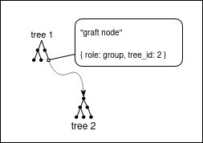
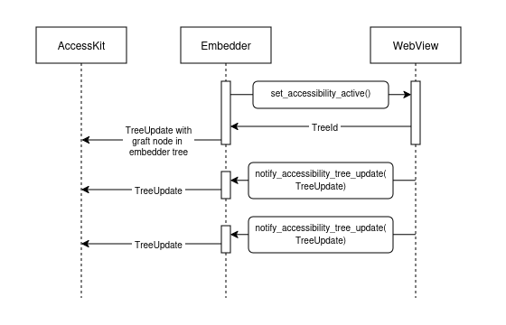
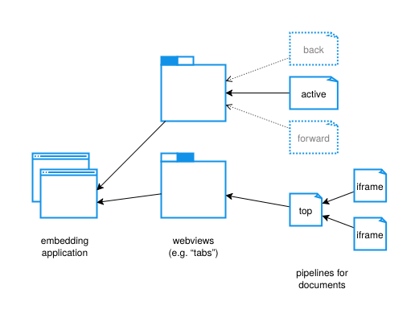
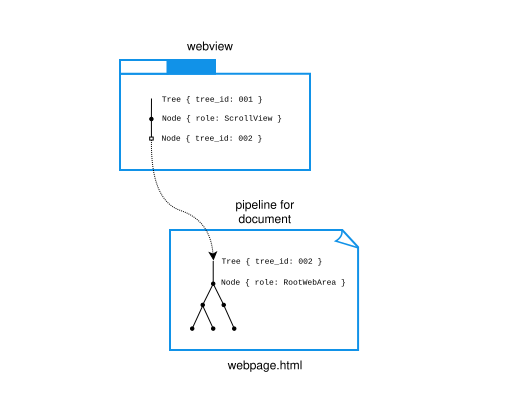

# Accessibility

## TODO: patch analysis

- [#44768](https://github.com/servo/servo/pull/44768)
    - towards a future where we traverse the accessibility tree instead of the DOM tree (for aria-owns?)
    - ended up refactoring the methods, which could help with profiling
- [#44767](https://github.com/servo/servo/pull/44767)
    - accessibility node ids are sequential u64
    - u64 is big enough that Servo can create 2^32 new nodes per second for 136 years without overflow, so we don’t need to do anything special to avoid collisions.
    - accessibility node ids can outlive DOM nodes in the AT and in action requests, so decoupling the ids from DOM node addresses is necessary to avoid potential incorrect targeting of action requests when a DOM node has since been freed and its address reused
- [#44766](https://github.com/servo/servo/pull/44766)
    - setters/getters are purely procedural
    - node mutations now set updated flag on AccessibilityNode (which controls whether the node goes in the TreeUpdate), rather than ad-hoc bubbling out to locals, which made it easy to only set updated when a property genuinely has a different value
- [#44473](https://github.com/servo/servo/pull/44473)
    - fix crash when reloading; we deactivate a11y when navigating away from a page, which includes reloading, but when reloading, the pipeline seems to get closed before we can deactivate accessibility. so ignore attempts to deactivate a11y on closed pipelines (because that’s a normal part of reloading), but log an error without panicking when activating a11y on closed pipelines (which should in theory never happen)
- [#44439](https://github.com/servo/servo/pull/44439)
    - implement name from content <https://w3c.github.io/aria/#namefromcontent>, walking the accessibility tree
- [#44438](https://github.com/servo/servo/pull/44438)
    - use ArcRefCell, like the rest of layout, because classical ownership means that all of your methods have to be (&mut self), which means the whole tree is tied up, and together that means you can’t make (&self) helper methods that read from the tree. also this causes problems for recursion?
- [#44437](https://github.com/servo/servo/pull/44437)
    - dedupe nodes that get changed multiple times within one TreeUpdate (don’t remember if this happens in practice?)
- [#44255](https://github.com/servo/servo/pull/44255)
    - build a minimal tree with some non-interactive roles like paragraphs and headings, rather than just text nodes and generic containers
- [#44208](https://github.com/servo/servo/pull/44208)
    - don’t send a message for the tree update from layout to script, because layout now runs on the script thread, just send it to libservo directly
- [#43772](https://github.com/servo/servo/pull/43772)
    - don’t send an empty TreeUpdate for the WebView with no pipeline graft, because it’s not necessary
    - don’t set label on graft nodes, because nothing can see it really (other than consumer API itself)
    - rename method for clarity and make it pub(crate) not pub
- [#43558](https://github.com/servo/servo/pull/43558)
    - in servoshell, activate accessibility in all webviews *and* plumb the webview a11y trees into the app’s main tree, because if we do the former without the latter, accesskit will panic!
- [#43556](https://github.com/servo/servo/pull/43556)
    - graft active top-level pipeline trees into webview trees whenever the webview navigates (including both normal and bfcache navigations)
    - we steer clear of doing anything about iframes, but we expect that the grafts for those will be done by the containing document’s layout (see “Graft node ordering problems in Servo Accessibility” § iframe support)
    - implicit: we detach the a11y tree of the old document when navigating (rather than say, keeping it but somehow marking it “hidden”), which effectively destroys it in accesskit (central cache) and hence the platform. we also deactivate accessibility in the document, which effectively destroys it in our internal tree. combined that means if we do a bfcache navigation, we need to rebuild the a11y tree from scratch, which is unfortunate because it partially defeats the bfcache. maybe we can revisit one or both of these? note that firefox does not retain those trees in the platform at least (not sure about the central cache or internally)
- [#43029](https://github.com/servo/servo/pull/43029)
    - change API from Servo::set_accessibility_active to WebView::set_accessibility_active
    - aligns more closely with the fact that embedders get an accesskit subtree per webview, and need to graft the subtrees for each webview into the app’s main tree
    - new API design encourages correct use by returning the TreeId with each WebView::set_accessibility_active call
    - internally move from activating all documents in each ScriptThread, to activating one document at a time
        - may have proved useful later for bfcache navigation, where we have to deactivate a11y upon navigating away
- [#43013](https://github.com/servo/servo/pull/43013)
    - add active_top_level_pipeline_id field and update it when the frame tree changes
    - later became Option, because we found that our logic relied on the None → Some transition for new tabs/windows
- [#43012](https://github.com/servo/servo/pull/43012)
    - introduces the three levels of grafts (embedder to webview, webview to pipeline, and pipeline to pipeline)
    - if pipelines generate random TreeId, they need to communicate it to the constellation somehow
        - this is asynchronous, so more plumbing and more potential for timing problems
    - instead we derive a TreeId from the PipelineId as a UUIDv5, which the constellation can do on its own
    - caveat: now you can’t run more than one `Servo` in an application (if that was even possible before?)
- [#42402](https://github.com/servo/servo/pull/42402)
    - update accesskit to include subtree support; we had to coordinate updates in egui and kittest also
- [#42338](https://github.com/servo/servo/pull/42338)
    - initial tree building in layout
    - observes that if the constellation sends a TreeId to libservo, and script sends a TreeUpdate to libservo, there’s no guarantee that the TreeId is received before the TreeUpdate, even though it was the constellation that originally kicked off both
    - ordering issues solved with epoch (see “Graft node ordering problems in Servo Accessibility”)
    - to ensure that bfcache navigations work, we also deactivate a11y in the old pipeline when navigating away
- [#42336](https://github.com/servo/servo/pull/42336)
    - old Servo::set_accessibility_active API
    - would activate a11y in all event loops (all script threads), which would in turn activate a11y in all of their documents
- [#42333](https://github.com/servo/servo/pull/42333)
    - pref. note that enabled ≠ active
- [#41924](https://github.com/servo/servo/pull/41924)
    - plumbing – everything between layout and the embedder
    - has one unnecessary message from layout to script, later eliminated in [#44208](https://github.com/servo/servo/pull/44208)
    - otherwise quite direct, going directly from script thread to embedder’s main thread, no constellation or anything

## Background: AccessKit concepts

[AccessKit](https://accesskit.dev) provides a platform-independent schema for exposing information about the application's UI to assistive technology APIs.

### Accessibility tree

Accessibility information is provided to platform accessibility APIs as a tree of nodes, representing the different parts of the UI - for example, a node representing a toolbar may contain nodes representing buttons.

Platform APIs allow assistive technologies like screen readers to present an alternative user interface (for example, a speech- or braille-based interface) to users, and allow those interfaces to be interacted with via the assistive technology by allowing the assistive technology to relay user interactions back to the application.

A browser's accessibility tree combines the accessibility tree for its own UI (the address bar, and so on) with the accessibility trees for any active documents, so that users can use assistive technology to interact with web pages being shown in the browser.

### Central cache

Since assistive technologies need to query the tree frequently and synchronously, multi-process browsers typically cache the tree centrally to allow them to do so without incurring IPC latency or interrupting web content processes.

This principle is behind the accessibility architecture of Chromium ([docs](https://chromium.googlesource.com/chromium/src/+/d779ec8c0ed366ee689e3a30132b9b8c98a9a941/docs/accessibility/browser/how_a11y_works_2.md)) and Firefox ([Cache the World](https://www.jantrid.net/2022/12/22/Cache-the-World/)).
In these architectures, the main browser process retains an in-memory accessibility tree composed of the tree representing the browser UI plus the sub-trees for any web contents being shown in the browser (including tabs which are currently not showing).
Each renderer process is responsible for communicating _updates_ to its accessibility tree to the main process for incorporation into the aggregated tree.
The accessibility trees are all represented internally in a platform-independent manner, and mapped to the respective platform APIs for the platform the browser is running on.

The [basic design of AccessKit](https://accesskit.dev/how-it-works/) is based on Chromium's original multi-process accessibility architecture, which also influenced Firefox's "Cache the World" design.
It provides a platform-independent, serializable schema centered on the concept of tree updates, as well as an API to allow consuming those updates to create an in-memory tree which can be mapped to platform APIs.
Typically, application developers only need to be concerned with producing the tree updates; AccessKit provides "adapters" which consume the updates, retain the cached full tree, and communicate with platform APIs.

### AccessKit data types

#### `Node`

AccessKit provides a [`Node`](https://docs.rs/accesskit/0.24.0/accesskit/struct.Node.html) type to represent a node in the accessibility tree.
A `Node` _must_ have a [`Role`](https://docs.rs/accesskit/0.24.0/accesskit/enum.Role.html) value, and may have many other properties, including [`children`](https://docs.rs/accesskit/0.24.0/accesskit/struct.Node.html#method.children).

`Node` is designed to be serializable, so it can be easily passed between processes.

#### `NodeId`

Each `Node` is associated with a [`NodeId`](https://docs.rs/accesskit/0.24.0/accesskit/struct.NodeId.html), which must be unique within the node's tree.
Properties which refer to other nodes in the tree, including `children`, refer to nodes by their `NodeId`s.

`Node` doesn't have an ID property; rather, the mechanism for associating a `Node` with a `NodeId` is via `TreeUpdate`.

#### `TreeUpdate`

[`TreeUpdate`](https://docs.rs/accesskit/0.24.0/accesskit/struct.TreeUpdate.html) represents a _change_ to an accessibility tree.
The initial full tree for an application or subtree is sent as a `TreeUpdate` with all known nodes, and the necessary metadata for the tree; subsequent `TreeUpdate`s need only include nodes which have changed and the tree's `TreeId`.
Any node which is added or changed in any way, including adding or removing child nodes, must be included in the `TreeUpdate` in full (i.e. not only changed properties for the node).

Somewhat counter-intuitively, AccessKit doesn't provide a schema for an accessibility tree data structure to be used as a "source" for `TreeUpdate`s - it's up to the application to produce `TreeUpdate`s based on any UI changes in any way it sees fit.

The bulk of each `TreeUpdate` is a vector of `(NodeId, Node)` pairs; each `NodeId` must be unique to the [`TreeId`](https://docs.rs/accesskit/0.24.0/accesskit/struct.TreeId.html) that the `TreeUpdate` refers to.
The rest of the `TreeUpdate` consists of the `TreeId` for the tree, the `NodeId` of the currently focused node, and optionally some metadata about the tree (required if this is the first `TreeUpdate` for this `TreeId`).

Each `TreeUpdate` can only have one `TreeId`; this determines the ID space for the `NodeId`s in the update.

### Subtrees

AccessKit allows applications to nest separate trees to avoid needing to maintain global uniqueness of NodeIds.

Nesting a tree as a subtree of another tree is a two-step process, where the order is critical:

1. Send a `TreeUpdate` for the _parent_ tree which includes a [`Node`](https://docs.rs/accesskit/0.24.0/accesskit/struct.Node.html) with a [`tree_id`](https://docs.rs/accesskit/0.24.0/accesskit/struct.Node.html#method.tree_id) value equal to the `TreeId` of the _child_ tree. This `Node` becomes a _graft node_ for the subtree.
2. Send a `TreeUpdate` for the _child_ tree with the matching [`tree_id`](https://docs.rs/accesskit/0.24.0/accesskit/struct.TreeUpdate.html#structfield.tree_id) value.

Any `TreeUpdate` with a `tree_id` value other than [`TreeId::ROOT`](https://docs.rs/accesskit/0.24.0/accesskit/struct.TreeId.html#associatedconstant.ROOT) MUST be preceded by a `TreeUpdate` containing a `Node` with the same `tree_id` value; otherwise, the AccessKit adapter consuming the `TreeUpdate` will panic.



### Adapters

`Node`s and `TreeUpdate`s allow an application to describe a platform-independent accessibility tree.
Adapters map between this platform-independent representation and the various platform-specific accessibility APIs.

Typically, an adapter will provide a method which takes a `TreeUpdate`, and uses the [`accesskit_consumer` API](https://docs.rs/accesskit_consumer/latest/accesskit_consumer/index.html) to update an in-memory tree which can be queried via platform APIs, triggering the appropriate notifications to the API in the process.

AccessKit provides platform-specific adapters for Linux, macOS and Windows, as well as a cross-platform [`accesskit_winit`](https://crates.io/crates/accesskit_winit) adapter which can be used by projects using the `winit` cross-platform windowing library.
`accesskit_winit` pulls in the respective platform-specific adapters under the hood.

### Actions

Finally, AccessKit provides an [`ActionRequest`](https://docs.rs/accesskit/0.24.0/accesskit/struct.ActionRequest.html) type for relaying user actions from assistive technology back to the application in a platform-independent way.
Adapters provide hooks for the application to be notified of action requests to be able to handle user actions.

## Servo accessibility for embedders

While the system is being developed, the [`accessibility_enabled`](https://doc.servo.org/servo/prefs/struct.Preferences.html#structfield.accessibility_enabled) pref must be set in order to enable the accessibility code to run.

The entry point for enabling accessibility is [`WebView::set_accessibility_active()`](https://doc.servo.org/servo/webview/struct.WebView.html#method.set_accessibility_active).
This will return a randomly-generated `TreeId`, which will remain stable for the lifetime of the WebView.
The WebView's `TreeId` can also be accessed via the [`accesskit_tree_id()`](https://doc.servo.org/servo/webview/struct.WebView.html#method.accesskit_tree_id) method.
This `TreeId` must be used to create a [graft node](#subtrees) in the embedder's application tree by sending a `TreeUpdate` to AccessKit Adapter including a node with a `tree_id` value corresponding to the WebView's `TreeId`, before any `TreeUpdate`s are forwarded to AccessKit from the WebView.

```
NOTE: this influenced our decision to change activation from a Servo method to a WebView method in [#43029](https://github.com/servo/servo/pull/43029)
```

Once accessibility is active for the WebView, it will begin to emit `TreeUpdate`s via the [`WebViewDelegate::notify_accessibility_tree_update()`](https://doc.servo.org/servo/trait.WebViewDelegate.html#method.notify_accessibility_tree_update) method.
Once the graft node has been created, these `TreeUpdate`s can be forwarded directly to the AccessKit adapter.

The `WebView` will continue to emit `TreeUpdate`s for any change to its accessibility tree until either its `set_accessibility_active()` method is used to deactivate the accessibility tree, or its lifetime ends.
Accessibility tree changes will be triggered by navigations within the webview, as well as any changes to the currently active document.
Servo manages subtrees within the `WebView`'s accessibility tree; the embedder only needs to ensure that there is a graft node for the `WebView` in its top-level tree, and that Servo's `TreeUpdate`s are sent to the adapter in the order in which they are emitted from Servo.



Still to be implemented: embedder API for forwarding actions to the appropriate WebView.

## Servo accessibility tree internal design



<details>
<summary>Full description of Servo accessibility trees diagram</summary>
The diagram shows different components of an embedding application nesting within one another in a tree structure, with the root node at the left and the leaf nodes to the right. It's loosely arranged in columns, with labels for each column:
- embedding application, on the left;
- webviews (e.g. "tabs"), in the middle;
- pipelines for documents, on the right.

The root node is the embedding application, shown as two application windows.

The embedding application has two arrows pointing into it, from two webviews. The two webviews are shown as two separate tabs in a tab component.

The top webview has one solid arrow pointing into it, from a document labelled "active", and two dotted arrows from documents labelled "back" and "forward" respectively.

The bottom webiew has a single, solid arrow pointing into it from a document labelled "top". This document, in turn, has two solid arrows pointing into it, from two documents each labelled "iframe".
</details>

### WebView subtree

Each WebView has a minimal tree consisting of a [`ScrollView`](https://docs.rs/accesskit/0.24.0/accesskit/enum.Role.html#variant.ScrollView) and a graft node for the top-level pipeline (i.e. the top-level document).

A `TreeUpdate` with an updated graft node is emitted when accessibility is enabled for the WebView, and when the top-level pipeline (i.e. the top-level Document) changes.



### Accesibility state for ConstellationWebView and Pipelines

When accessibility is activated for a WebView, the WebView notifies the constellation via `EmbedderToConstellationMessage::SetAccessibilityActive` that accessibility should be activated for the corresponding `ConstellationWebView.`

This sets the `accessibility_active` flag on the ConstellationWebView, and sends a `ScriptThreadMessage::SetAccessibilityActive` message to all active pipelines for the WebView.

The Constellation also immediately sends back a `EmbedderMsg::AccessibilityTreeIdChanged` message with the pipeline ID for the top-level pipeline for the WebView, so that the WebView can create a `TreeUpdate` for the graft node.


### Deterministic `TreeId` generation for `Pipeline`s

[#43012](https://github.com/servo/servo/pull/43012)

To allow synchronous generation of the `TreeUpdate` updating the graft node's `TreeId`, we have a deterministic mapping from a `PipelineId` to `accesskit::TreeId`.
This means we don't need to wait for the `Pipeline` to generate a random ID and notify the `WebView` of its value, so that the `TreeUpdate` with the graft node can be sent before the `TreeUpdate` with the document's initial tree.

This is implemented using the [`Uuid::new_v5()`](https://docs.rs/uuid/latest/uuid/struct.Uuid.html#method.new_v5) method, using a static namespace value combined with the pipeline ID.


### Generating `TreeUpdate`s in `layout`

When the ScriptThread receives the `ScriptThreadMessage::SetAccessibilityActive` message for a pipeline, it locates the Document for that pipeline, and calls the `set_accessibility_active()` method on its LayoutThread.

This causes the LayoutThread to:
- create an instance of `AccessibilityTree` which is stored in its `accessibility_tree` property and acts as a flag for its accessibility activation;
- sets the `needs_accessibility_update` flag for the layout, which marks it as needing the accessibility tree to be updated in the next reflow.

If no reflow is otherwise required, having the `needs_accessibility_update` flag will ensure a rendering update occurs, as it is checked in Document's [`needs_rendering_update()`](https://doc.servo.org/script/dom/document/document/struct.Document.html#method.needs_rendering_update) method, and LayoutThread's [`can_skip_reflow_request_entirely()`](https://doc.servo.org/layout/layout_impl/struct.LayoutThread.html#method.can_skip_reflow_request_entirely) method.

When the next reflow occurs, if the LayoutThread's `accessibility_tree` property is set, the accessibility tree update occurs as a phase after all the other phases in [`handle_reflow()`](https://doc.servo.org/layout/layout_impl/struct.LayoutThread.html#method.handle_reflow).
This primarily consists of calling the `update_tree()` method on `AccessibilityTree`, which returns a `TreeUpdate`.
The `TreeUpdate` is emitted back to the embedder via [`ScriptThreadMessage::AccessibilityTreeUpdate`](https://doc.servo.org/script_traits/enum.ScriptThreadMessage.html#variant.AccessibilityTreeUpdate), [`EmbedderMessage::AccessibilityTreeUpdate`](https://doc.servo.org/servo/enum.EmbedderMsg.html#variant.AccessibilityTreeUpdate) and finally [`WebViewDelegate::notify_accessibility_tree_update()`](https://doc.servo.org/servo/trait.WebViewDelegate.html#method.notify_accessibility_tree_update).

### `AccessibilityTree`

```
// TODO: link to generated docs once landed
// Something like https://doc.servo.org/layout/accessibility_tree
```

`AccessibilityTree` represents the accessibility tree for a particular Document.

```
// TODO: finish
```


## Servo accessibility tree testing

- Using the `accesskit_consumer` API to generate an in-memory tree from Servo `TreeUpdates`

```
// TODO: finish
```


## Servoshell accessibility tree integration

```
// TODO: write
```

# TODOs

- Adapters typically use accesskit_consumer to ingest tree updates; consumer can also be useful in other ways
    - Add section on `accesskit_consumer`?
- Future directions for testing
    - WebDriver methods
    - platform API testing using WPT integration (requires mapping DOM ID through to platform APIs which is not yet implemented in AccessKit)
- Link to PRs introducing various concepts?
    - Maybe just a standalone paragraph with the GitHub PR number as a link
