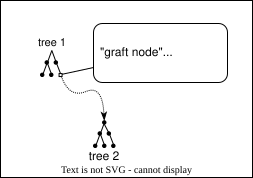

# Accessibility Background

## Accessibility tree

Accessibility information is provided to platform accessibility APIs as a tree of nodes, representing the different parts of the UI - for example, a node representing a toolbar may contain nodes representing buttons.

Platform APIs allow assistive technologies like screen readers to present an alternative user interface (for example, a speech- or braille-based interface) to users, and allow those interfaces to be interacted with via the assistive technology by allowing the assistive technology to relay user interactions back to the application.

A browser's accessibility tree combines the accessibility tree for its own UI (the address bar, and so on) with the accessibility trees for any active documents, so that users can use assistive technology to interact with web pages being shown in the browser.

## AccessKit concepts

[AccessKit](https://accesskit.dev) provides a platform-independent schema for exposing information about the application's UI to assistive technology APIs.

### Central cache

Since assistive technologies need to query the tree frequently and synchronously, multi-process browsers typically cache the tree centrally to allow them to do so without incurring IPC latency or interrupting web content processes.

This principle is behind the accessibility architecture of Chromium ([docs](https://chromium.googlesource.com/chromium/src/+/d779ec8c0ed366ee689e3a30132b9b8c98a9a941/docs/accessibility/browser/how_a11y_works_2.md)) and Firefox ([Cache the World](https://www.jantrid.net/2022/12/22/Cache-the-World/)).
In these architectures, the main browser process retains an in-memory accessibility tree composed of the tree representing the browser UI plus the sub-trees for any web contents being shown in the browser (including tabs which are currently not showing).
Each renderer process is responsible for communicating _updates_ to its accessibility tree to the main process for incorporation into the aggregated tree.
The accessibility trees are all represented internally in a platform-independent manner, and mapped to the respective platform APIs for the platform the browser is running on.

The [basic design of AccessKit](https://accesskit.dev/how-it-works/) is based on Chromium's original multi-process accessibility architecture, which also influenced Firefox's "Cache the World" design.
It provides a platform-independent, serializable schema centered on the concept of tree updates, as well as an API to allow consuming those updates to create an in-memory tree which can be mapped to platform APIs.
Typically, application developers only need to be concerned with producing the tree updates; AccessKit provides "adapters" which consume the updates, retain the cached full tree, and communicate with platform APIs.

### AccessKit data types

#### `Node`

AccessKit provides a [`Node`](https://docs.rs/accesskit/0.24.0/accesskit/struct.Node.html) type to represent a node in the accessibility tree.
A `Node` _must_ have a [`Role`](https://docs.rs/accesskit/0.24.0/accesskit/enum.Role.html) value, and may have many other properties, including [`children`](https://docs.rs/accesskit/0.24.0/accesskit/struct.Node.html#method.children).

`Node` is designed to be serializable, so it can be easily passed between processes.

#### `NodeId`

Each `Node` is associated with a [`NodeId`](https://docs.rs/accesskit/0.24.0/accesskit/struct.NodeId.html), which must be unique within the node's [tree](#subtrees).
Properties which refer to other nodes in the tree, including `children`, refer to nodes by their `NodeId`s.

`Node` doesn't have an ID property; rather, the mechanism for associating a `Node` with a `NodeId` is via `TreeUpdate`.

#### `TreeUpdate`

[`TreeUpdate`](https://docs.rs/accesskit/0.24.0/accesskit/struct.TreeUpdate.html) represents a _change_ to an accessibility tree.
The initial full tree for an application or subtree is sent as a `TreeUpdate` with all known nodes, and the necessary metadata for the tree; subsequent `TreeUpdate`s need only include nodes which have changed and the tree's `TreeId`.
Any node which is added or changed in any way, including adding or removing child nodes, must be included in the `TreeUpdate` in full (i.e. not only changed properties for the node).

Somewhat counter-intuitively, AccessKit doesn't provide a schema for an accessibility tree data structure to be used as a "source" for `TreeUpdate`s - it's up to the application to produce `TreeUpdate`s based on any UI changes in any way it sees fit.

The bulk of each `TreeUpdate` is a vector of `(NodeId, Node)` pairs; each `NodeId` must be unique to the [`TreeId`](https://docs.rs/accesskit/0.24.0/accesskit/struct.TreeId.html) that the `TreeUpdate` refers to.
The rest of the `TreeUpdate` consists of the `TreeId` for the tree, the `NodeId` of the currently focused node, and optionally some metadata about the tree (required if this is the first `TreeUpdate` for this `TreeId`).

Each `TreeUpdate` can only have one `TreeId`; this determines the ID space for the `NodeId`s in the update.

### Subtrees

AccessKit allows applications to nest separate trees to avoid needing to maintain global uniqueness of NodeIds.

Nesting a tree as a subtree of another tree is a two-step process, where the order is critical:

1. Send a `TreeUpdate` for the _parent_ tree which includes a [`Node`](https://docs.rs/accesskit/0.24.0/accesskit/struct.Node.html) with a [`tree_id`](https://docs.rs/accesskit/0.24.0/accesskit/struct.Node.html#method.tree_id) value equal to the `TreeId` of the _child_ tree. This `Node` becomes a _graft node_ for the subtree.
2. Send a `TreeUpdate` for the _child_ tree with the matching [`tree_id`](https://docs.rs/accesskit/0.24.0/accesskit/struct.TreeUpdate.html#structfield.tree_id) value.

Any `TreeUpdate` with a `tree_id` value other than [`TreeId::ROOT`](https://docs.rs/accesskit/0.24.0/accesskit/struct.TreeId.html#associatedconstant.ROOT) MUST be preceded by a `TreeUpdate` containing a `Node` with the same `tree_id` value; otherwise, the AccessKit adapter consuming the `TreeUpdate` will panic.

### Adapters

`Node`s and `TreeUpdate`s allow an application to describe a platform-independent accessibility tree.
Adapters map between this platform-independent representation and the various platform-specific accessibility APIs.

Typically, an adapter will provide a method which takes a `TreeUpdate`, and uses the [`accesskit_consumer` API](https://docs.rs/accesskit_consumer/latest/accesskit_consumer/index.html) to update an in-memory tree which can be queried via platform APIs, triggering the appropriate notifications to the API as it does so.

AccessKit provides platform-specific adapters for Linux, macOS and Windows, as well as a cross-platform [`accesskit_winit`](https://crates.io/crates/accesskit_winit) adapter which can be used by projects using the `winit` cross-platform windowing library.
`accesskit_winit` pulls in the respective platform-specific adapters under the hood.

### Actions

Finally, AccessKit provides an [`ActionRequest`](https://docs.rs/accesskit/0.24.0/accesskit/struct.ActionRequest.html) type for relaying user actions from assistive technology back to the application in a platform-independent way.
Adapters provide hooks for the application to be notified of action requests, so that they can handle user actions.
