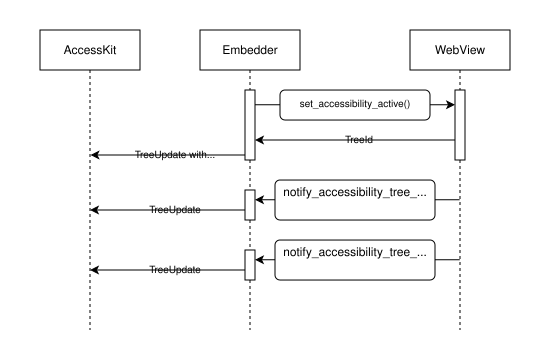

# Servo accessibility for embedders

## Activating accessibility for a `WebView`

The entry point for activating accessibility is [`WebView::set_accessibility_active()`](https://doc.servo.org/servo/webview/struct.WebView.html#method.set_accessibility_active).
This will return a randomly-generated `TreeId`, which will remain stable for the lifetime of the WebView.
The WebView's `TreeId` can also be accessed via the [`accesskit_tree_id()`](https://doc.servo.org/servo/webview/struct.WebView.html#method.accesskit_tree_id) method.

> [!IMPORTANT]
> The `WebView`'s `TreeId` _must_ be used to create a [graft node](#subtrees) in the embedder's application tree by sending a `TreeUpdate` to the AccessKit Adapter including a node with a `tree_id` value corresponding to the WebView's `TreeId`, _before_ any `TreeUpdate`s are forwarded to AccessKit from the WebView.

<!--
This influenced our decision to change activation from a Servo method to a WebView method in [#43029](https://github.com/servo/servo/pull/43029).
-->

Once accessibility is active for the WebView, it will begin to emit `TreeUpdate`s via the [`WebViewDelegate::notify_accessibility_tree_update()`](https://doc.servo.org/servo/trait.WebViewDelegate.html#method.notify_accessibility_tree_update) method.
Once the graft node has been created, these `TreeUpdate`s can be forwarded directly to the AccessKit adapter.

The `WebView` will continue to emit `TreeUpdate`s for any change to its accessibility tree until either its `set_accessibility_active()` method is used to deactivate the accessibility tree, or its lifetime ends.
Accessibility tree changes will be triggered by navigations within the webview, as well as any changes to the contents of the currently active document.

Servo manages subtrees within the `WebView`'s accessibility tree; the embedder only needs to ensure that there is a graft node for the `WebView` in its top-level tree, and that Servo's `TreeUpdate`s are sent to the adapter in the order in which they are emitted from Servo.

> [!NOTE]
> The updates from the `WebView` are currently one-way: we don't yet support [`ActionRequest`](https://docs.rs/accesskit/latest/accesskit/struct.ActionRequest.html)s.

Per-`WebView` accessibility activation was added in [#42309](https://github.com/servo/servo/pull/43029).