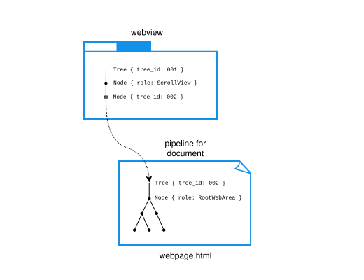
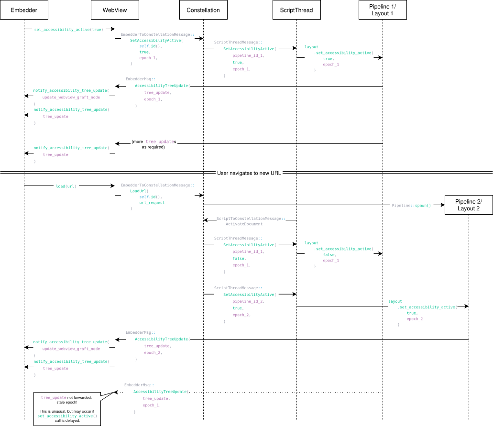

# WebView accessibility internals

As described in the [Servo accessibility for embedders](for-embedders.md) section, the Servo accessibility system is exposed to embedders on a per-`WebView` basis.

The `WebView` has a [minimal tree](#webview-subtree) of its own, which essentially exists to provide a [graft node](background.md#subtrees) for its top-level [`Pipeline`](https://doc.servo.org/servo_constellation/pipeline/struct.Pipeline.html)'s accessibility tree.

The tree for the pipeline is generated based on its document's structure by [layout::AccessibilityTree](https://doc.servo.org/layout/accessibility_tree/struct.AccessibilityTree.html).
This tree is created when accessibility is activated for the pipeline, and updated each time the document is reflowed.
Any changes to the tree are captured in a `TreeUpdate`, which is sent to the embedder.

> [!NOTE]
> We currently don't support accessibility trees in IFrames.

## WebView subtree

Each WebView has a minimal tree consisting of a [`ScrollView`](https://docs.rs/accesskit/0.24.0/accesskit/enum.Role.html#variant.ScrollView) and a graft node for the top-level pipeline (i.e. the top-level document).

[#43029](https://github.com/servo/servo/pull/43029) first introduced the minimal tree for `WebView`s.

A `TreeUpdate` with an updated graft node is emitted when accessibility is [activated](https://doc.servo.org/servo/struct.WebView.html#method.set_accessibility_active) for the WebView, and when the WebView navigates to another top-level Document, causing its top-level `Pipeline` to change.

[#43556](https://github.com/servo/servo/pull/43556) first introduced the graft node between the `WebView` and the document.

## Accessibility activation

When an embedder calls `set_accessibility_active(true)` on a `WebView`, the `WebView` assumes responsibility for ensuring that until accessibility is deactivated or the `WebView` is destroyed, the embedder will receive `TreeUpdate`s representing the `WebView` and its current contents at any given time.

In order to do this, it needs to activate accessibility in its top-level [`Pipeline`](https://doc.servo.org/servo_constellation/pipeline/struct.Pipeline.html) both immediately, and whenever the top-level `Pipeline` changes.
It also de-activates accessibility in any inactive pipelines (i.e. any pipelines which don't correspond to a Document currently being shown, but which are retained by the [back/forward cache](https://developer.mozilla.org/en-US/docs/Glossary/bfcache)).

The basic initial flow is:

1. The embedder application calls [`set_accessibility_active(true)`](https://doc.servo.org/servo/webview/struct.WebView.html#method.set_accessibility_active) on the `WebView`.
    - This causes the `WebView` to randomly generate and store a `TreeId` for itself, which will remain consistent for the life of the `WebView` or until `set_accessibility_active(false)` is called.
2. The `WebView` sends a [`EmbedderToConstellationMessage::SetAccessibilityActive()`](https://doc.servo.org/servo_constellation_traits/enum.EmbedderToConstellationMessage.html#variant.SetAccessibilityActive) message to notify the constellation that accessibility should be activated for its top-level pipeline.
3. The constellation sends a [`ScriptThreadMessage::SetAccessibilityActive()`](https://doc.servo.org/script_traits/enum.ScriptThreadMessage.html#variant.SetAccessibilityActive) message to notify the script thread that accessibility should be activated for the specified pipeline.
4. The script thread calls [`set_accessibility_active()`](https://doc.servo.org/layout_api/trait.Layout.html#tymethod.set_accessibility_active) on the pipeline's [`LayoutThread`](https://doc.servo.org/layout/layout_impl/struct.LayoutThread.html).
5. On the next reflow, the `LayoutThread` generates an initial `TreeUpdate` for its accessibility tree, and sends an [`EmbedderMsg::AccessibilityTreeUpdate()`](https://doc.servo.org/embedder_traits/enum.EmbedderMsg.html#variant.AccessibilityTreeUpdate) message with the tree update.
6. The `WebView` retrieves the `TreeUpdate`'s [`tree_id`](https://doc.servo.org/accesskit/struct.TreeUpdate.html#structfield.tree_id) and stores it in its [`grafted_accesskit_tree_id`](https://doc.servo.org/servo/webview/struct.WebViewInner.html#structfield.grafted_accesskit_tree_id) field.
   It then generates a `TreeUpdate` representing its own [minimal tree](#webview-subtree) with the [graft node](background.md#subtrees)'s `tree_id` set to the `grafted_accesskit_tree_id`, and passes this `TreeUpdate` to its `WebViewDelegate`'s [`notify_accessibility_tree_update()`](https://doc.servo.org/servo/trait.WebViewDelegate.html#method.notify_accessibility_tree_update) method.
7. Once the graft node has been updated, the `WebView` can then call `notify_accessibility_tree_update()` again to forward the web contents' `TreeUpdate` built in step 5.

> [!IMPORTANT]
> The `WebView` must send the `TreeUpdate` updating its graft node before it forwards the first `TreeUpdate` from the pipeline in order to avoid a panic, due to the [ordering requirements](background.md#subtrees) for subtree grafting.

After accessibility has been activated on the pipeline, it will continue to send `TreeUpdate`s to the `WebView`.
After the first, there's no need to send a separate `TreeUpdate` for the `WebView`'s tree; the `TreeUpdate`s from the pipeline can be passed directly to [`notify_accessibility_tree_update()`](https://doc.servo.org/servo/trait.WebViewDelegate.html#method.notify_accessibility_tree_update).

### Handling navigations: grafted tree epoch

When there is a navigation, such as when a user enters a new URL in the address bar, clicks a link, or uses the Back or Forward buttons, the `WebView`'s top-level pipeline changes.
This means that it needs to:

- de-activate accessibility in the old top-level pipeline,
- activate accessibility in the new top-level pipeline,
- graft the tree for the new pipeline in place of the tree for the old pipeline,
- begin forwarding the tree updates from the new pipeline, and
- **ignore** any further tree updates from the old pipeline.

We manage this by tracking an [Epoch](https://doc.servo.org/servo_base/struct.Epoch.html) which is incremented every time the top-level pipeline changes.
This epoch is passed from the Constellation, where the top-level pipeline is set, to [`ScriptThreadMessage::SetAccessibilityActive()`](https://doc.servo.org/script_traits/enum.ScriptThreadMessage.html#variant.SetAccessibilityActive) along with the `PipelineId`.
It's then sent back to the `WebView` in [`EmbedderMsg::AccessibilityTreeUpdate()`](https://doc.servo.org/embedder_traits/enum.EmbedderMsg.html#variant.AccessibilityTreeUpdate), so that the `WebView` can check this against its existing [`grafted_accesskit_tree_epoch`](https://doc.servo.org/servo/webview/struct.WebViewInner.html#structfield.grafted_accesskit_tree_epoch).

- If the epoch hasn't changed, the `TreeUpdate` can simply be forwarded to the embedder.
- If the epoch is greater than the existing [`grafted_accesskit_tree_epoch`](https://doc.servo.org/servo/webview/struct.WebViewInner.html#structfield.grafted_accesskit_tree_epoch), that indicates that a new tree needs to be grafted, and the epoch value needs to be updated.
- If the epoch is _less_ than the existing `grafted_accesskit_tree_epoch`, the `TreeUpdate` should be ignored.

> [!IMPORTANT]
> If the `TreeUpdate` with a stale epoch was forwarded to the embedder, it could cause a panic, as it would contain a `TreeId` which is no longer grafted in the `WebView`'s tree.

> [!NOTE]
> Only the current document needs to be in the platform's accessibility tree.
> Updating the `WebView`'s graft node to graft in the tree for the current document will (correctly) cause the previously active document to be removed from the platform's accessibility tree.
> If and when the user navigates back to a previously-viewed document, the graft node will be updated again to graft in the accessibility tree for that document.
>
> However, deactivating accessibility in inactive pipelines means we destroy all of the accessibility tree information cached in layout for that pipeline.
> This means that even if the user navigates in the [session history](https://doc.servo.org/servo_constellation/session_history/index.html), we will always need to re-compute all accessibility data whenever a navigation occurs.
> [Issue #46471](https://github.com/servo/servo/issues/46471) proposes retaining accessibility data instead.

The pipeline epoch was introduced in [#42388](https://github.com/servo/servo/pull/42338).

## Deterministic `TreeId` generation for `Pipeline`s

We have a deterministic mapping from a `PipelineId` to `accesskit::TreeId`, implemented using the [`Uuid::new_v5()`](https://docs.rs/uuid/latest/uuid/struct.Uuid.html#method.new_v5) method, using a static namespace value combined with the pipeline ID.

This was implemented to allow immediately sending a `TreeUpdate` updating the `WebView`'s graft node without needing to wait for a message to return from the pipeline.
However, now we update the graft node immediately after receiving the first `TreeUpdate` from the new pipeline, which also includes the tree id.

We expect it will be still useful when implementing IFrame support: we would only need to have the pipeline ID for the embedded frame to turn the `<iframe>` element into a graft node.

See [#43012](https://github.com/servo/servo/pull/43012) for more discussion of the design.
