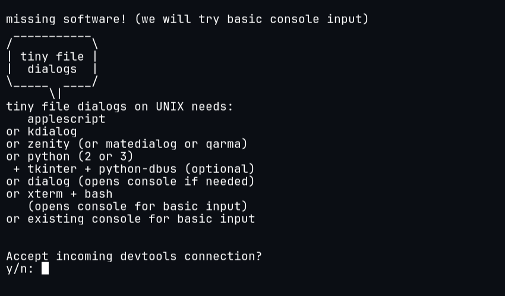
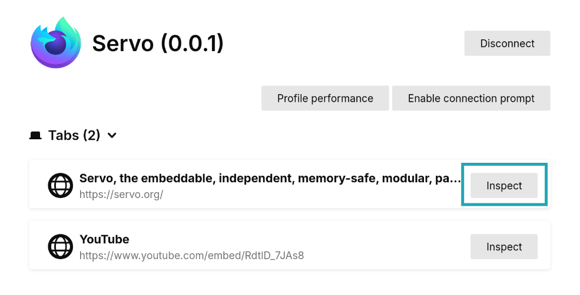
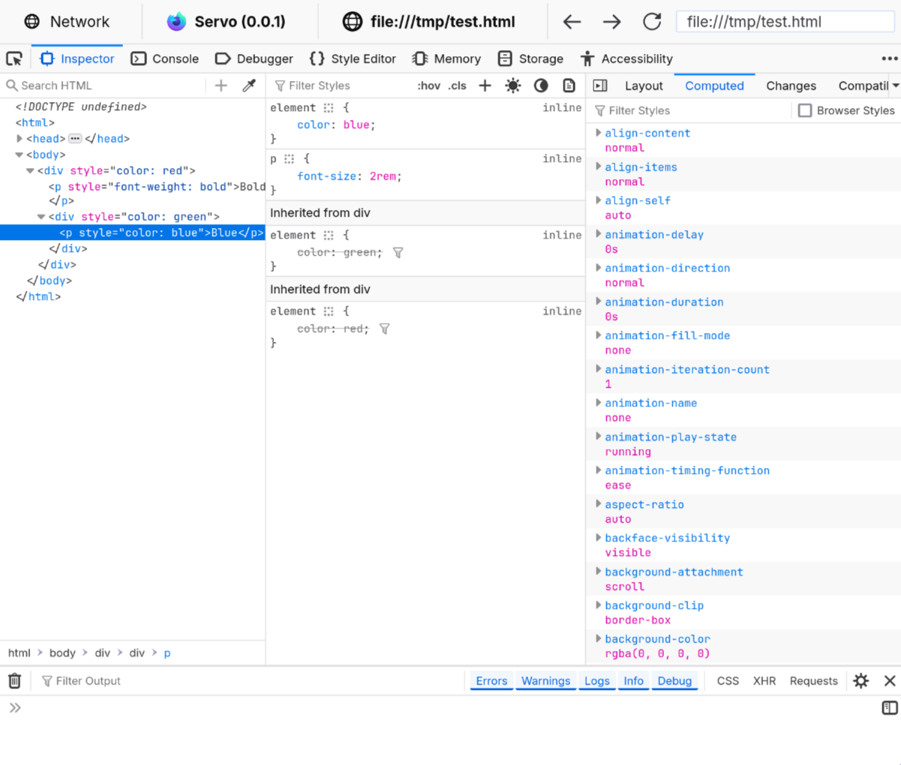

# DevTools

[Firefox DevTools](https://firefox-source-docs.mozilla.org/devtools-user) are a set of web developer tools that can be used to examine, edit, and debug a website's HTML, CSS, and JavaScript.
Servo has support for a subset of DevTools functionality, allowing for simple debugging.

## Connect to Servo

1. Run servoshell with the DevTools server enabled.
   Use the same port as before.

```sh
./mach run --devtools=6080
```

2. Open Firefox and go to `about:debugging`.
   If this is your first time using the DevTools integration, go to **Setup** and add `localhost:6080` as a [network location](https://firefox-source-docs.mozilla.org/devtools-user/about_colon_debugging/index.html#connecting-over-the-network).

3. Click on **Connect** in the sidebar next to `localhost:6080`.


4. Accept the incoming connection.
   If no confirmation dialog appears, press `Y` in the terminal that servoshell is running in.



5. Back in Firefox, choose a webview and click **Inspect**.
   A new window should open with the page's inspector.



## Using the inspector

The inspector window is divided in various tabs with different workspaces.
At the moment, **Inspector** and **Console** are working.

In the **Inspector** tab there are three columns.
From left to right:

- The **HTML tree** shows the document nodes.
  This allows you to see, add, or modify attributes by double-clicking on the tag name or attribute.
- The **style inspector** displays the associated CSS styling for one element.
  The entries here come from the element's style attribute, from a stylesheet, or are inherited.
  Styles can be added or modified by clicking on the style name or the empty space below.
- The **extra column** contains more helpful tools.
  The two relevant ones are the **Layout** tab, which contains information about the box model properties of the element (flex and grid do not work yet), and **Computed**, which contains a list of every calculated CSS value for the element.



The **Console** tab contains a JavaScript console that interfaces with the website being displayed in Servo.
Errors, warnings, and information that the website produces will be logged here.
It can also be used to run JavaScript code directly on the website, for example, changing the document content or reloading the page:

```js
document.write("Hello, Servo!")
location.reload()
```

<div class="warning">

**Note:** support for DevTools features is still a work in progress, and it can break in future versions of Firefox if there are changes to the messaging protocol.
</div>
