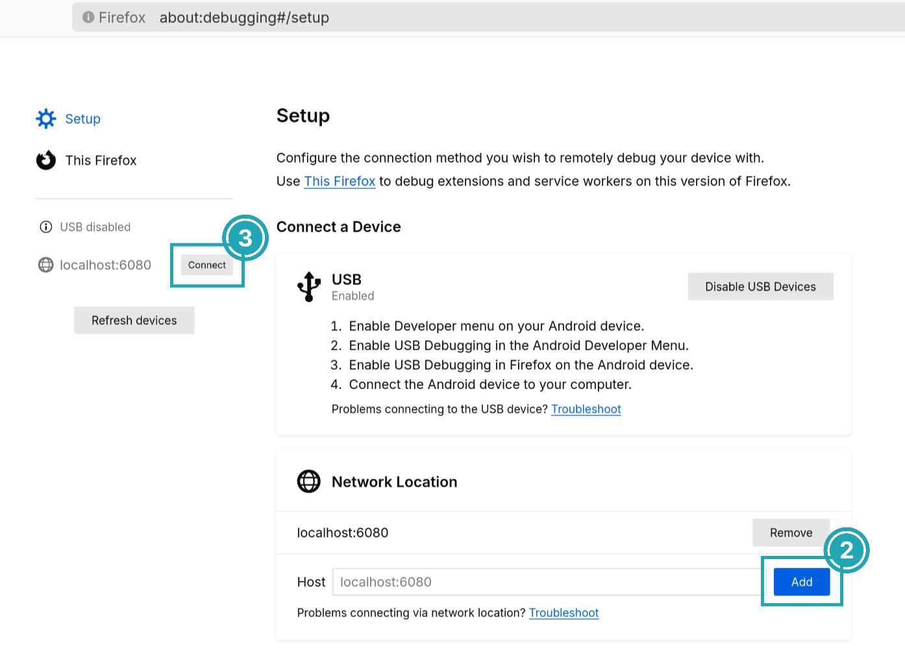

# DevTools

[Firefox DevTools](https://firefox-source-docs.mozilla.org/devtools-user) are a set of web developer tools that can be used to examine, edit, and debug a website's HTML, CSS, and JavaScript.
Servo has support for a subset of DevTools functionality, allowing for simple debugging.

## Connecting to Servo

1. Run servoshell with the DevTools server enabled.
   The number after the `devtools` parameter is the port used by the server.

```sh
./mach run --devtools=6080
```

2. Open Firefox and go to `about:debugging`.
   If this is your first time using the DevTools integration, go to **Setup** and add `localhost:6080` as a [network location](https://firefox-source-docs.mozilla.org/devtools-user/about_colon_debugging/index.html#connecting-over-the-network).
   The port number must be the same as in the previous step.

3. Click on **Connect** in the sidebar next to `localhost:6080`.



4. Back in Firefox, choose a webview and click **Inspect**.
   A new window should open with the page's inspector.


## Using the inspector

The inspector window is divided in various tabs with different workspaces.
At the moment, **Inspector** and **Console** are working.

In the **Inspector** tab there are three columns.
From left to right:

- The **HTML tree** shows the document nodes.
  This allows you to see, add, or modify attributes by double-clicking on the tag name or attribute.
- The **style inspector** displays the CSS styles associated with the selected element.
  The entries here come from the element's style attribute, from matching stylesheet rules, or inherited from other elements.
  Styles can be added or modified by clicking on a selector or property, or clicking in the empty space below.
- The **extra column** contains more helpful tools:
  - **Layout** contains information about the box model properties of the element.
    Note that flex and grid do not work yet.
  - **Computed**, which contains all the CSS [computed values](https://drafts.csswg.org/css-cascade/#computed) after resolving things like relative units.


The **Console** tab contains a JavaScript console that interfaces with the website being displayed in Servo.
Errors, warnings, and information that the website produces will be logged here.
It can also be used to run JavaScript code directly on the website, for example, changing the document content or reloading the page:

```js
document.write("Hello, Servo!")
location.reload()
```

<div class="warning">

**Note:** support for DevTools features is still a work in progress, and it can break in future versions of Firefox if there are changes to the messaging protocol.
</div>

## Capturing protocol traffic from Firefox

A lot of work to improve developer tool support in Servo requires reverse-engineering the working implementation in Firefox.
One of the most efficient ways to do this is to observe a successful session in Firefox and record the bidirectional protocol traffic between the server and the client.
To capture a log of the traffic in a Firefox DevTools session that does not involve Servo, follow these steps:

1. Open a terminal window. This window will eventually contain the protocol logs.
1. Launch Firefox from the terminal: `firefox --new-instance -P devtools-testing` (on macOS you may need `/Applications/Firefox.app/Contents/MacOS/firefox`).
1. On your first run:
    1. If the profile doesn't exist a window will open listing available profiles. Click on "Create Profile...".
    1. Follow the wizard steps to create a profile named `devtools-testing`.
    1. To avoid using this profile as a default, select your current profile and click "Start Firefox". Then, close the browser and launch Firefox again with `firefox --new-instance -P devtools-testing`. The profile selection window should not show up again.
    1. Open about:config and click on "Accept the Risk and Continue".
    1. Set `browser.dom.window.dump.enabled` to true.
    1. Set `devtools.debugger.log` to true.
    1. Set `devtools.debugger.log.verbose` to true.
1. Load a page that is relevant to your developer tools feature.
1. Visit `about:debugging` and interact with the developer tools feature using the "This Firefox" tab.
1. Close Firefox.

The terminal window now contains full debug server logs; copy them to somewhere for further analysis.
