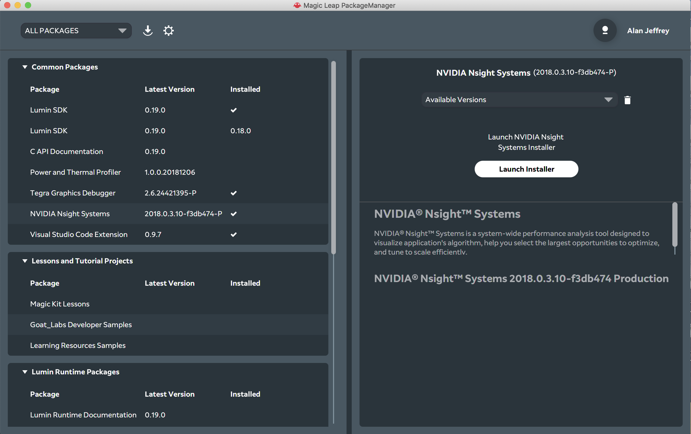
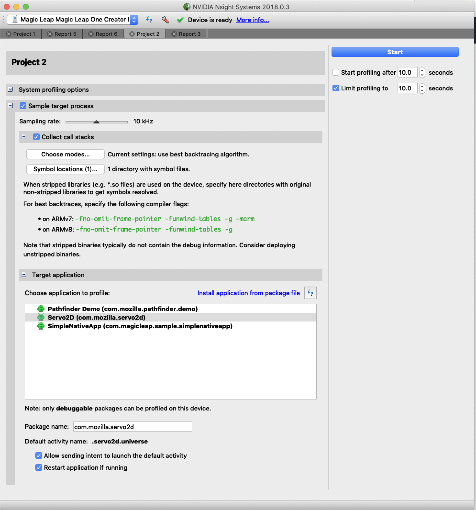
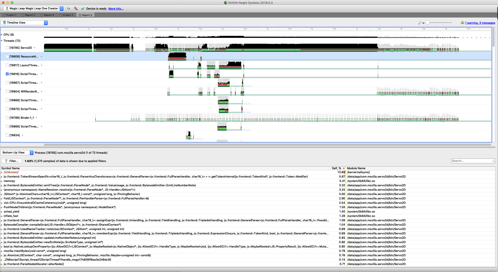

# TODO: wiki/Profiling

<!-- https://github.com/servo/servo/wiki/Profiling/1963e5c31e3319d7167f29181cbb6229cf7384eb -->

First, ensure that you are building Servo in release (optimized) mode with optimal debugging symbols:
In Cargo.toml:
```
[profile.release]
debug = true
lto = false
```
```
 ./mach build --release --with-frame-pointers
```

Several ways to get profiling information about Servo's runs:
* [Interval Profiling](#interval-profiling)
* [TSV Profiling](#tsv-profiling)
* [Generating Timelines](#generating-timelines)
* [Built-in sampling profiler](#sampling-profiler)
* [Using OSX Instruments](#using-osx-instruments)
* [Using Magic Leap NVIDIA Nsight](#using-magic-leap-nvidia-nsight)
* [Debugging JIT performance issues](https://github.com/servo/servo/wiki/Diagnosing-SpiderMonkey-JIT-issues)

## Interval Profiling

Using the -p option followed by a number (time period in seconds), you can spit out profiling information to the terminal periodically.
To do so, run Servo on the desired site (URLs and local file paths are both supported) with profiling enabled:
```
 ./mach run --release -p 5 https://www.cnn.com/
```

In the example above, while Servo is still running (AND is processing new passes), the profiling information is printed to the terminal every 5 seconds.

Once the page has loaded, hit ESC (or close the app) to exit.
Profiling output will be provided, broken down by area of the browser and URL.
For example, if you would like to profile loading Hacker News, you might get output of the form below:
```
[larsberg@lbergstrom servo]$ ./mach run --release -p 5 http://news.ycombinator.com/
_category_                          _incremental?_ _iframe?_             _url_                  _mean (ms)_   _median (ms)_      _min (ms)_      _max (ms)_       _events_ 
Compositing                             N/A          N/A                  N/A                        0.0440          0.0440          0.0440          0.0440               1
Layout                                  no           no      https://news.ycombinator.com/          29.8497         29.8497         29.8497         29.8497               1
Layout                                  yes          no      https://news.ycombinator.com/          11.0412         10.9748         10.8149         11.3338               3
+ Style Recalc                          no           no      https://news.ycombinator.com/          22.8149         22.8149         22.8149         22.8149               1
+ Style Recalc                          yes          no      https://news.ycombinator.com/           5.3933          5.2915          5.2727          5.6157               3
+ Restyle Damage Propagation            no           no      https://news.ycombinator.com/           0.0135          0.0135          0.0135          0.0135               1
+ Restyle Damage Propagation            yes          no      https://news.ycombinator.com/           0.0146          0.0149          0.0115          0.0175               3
+ Primary Layout Pass                   no           no      https://news.ycombinator.com/           3.3569          3.3569          3.3569          3.3569               1
+ Primary Layout Pass                   yes          no      https://news.ycombinator.com/           2.8727          2.8472          2.8279          2.9428               3
| + Parallel Warmup                     no           no      https://news.ycombinator.com/           0.0002          0.0002          0.0002          0.0002               2
| + Parallel Warmup                     yes          no      https://news.ycombinator.com/           0.0002          0.0002          0.0001          0.0002               6
+ Display List Construction             no           no      https://news.ycombinator.com/           3.4058          3.4058          3.4058          3.4058               1
+ Display List Construction             yes          no      https://news.ycombinator.com/           2.6722          2.6523          2.6374          2.7268               3
```

In this example, when loading the page we performed one full layout and three incremental layout passes, for a total of (29.8497 + 11.0412 * 3) = 62.9733ms.

## TSV Profiling

Using the -p option followed by a file name, you can spit out profiling information of Servo's execution to a TSV (tab-separated because certain url contained commas) file.
The information is written to the file only upon Servo's termination.
This works well with the -x OR -o option so that performance information can be collected during automated runs.
Example usage:
```
./mach run -r -o out.png -p out.tsv https://www.google.com/
```
The formats of the profiling information in the Interval and TSV Profiling options are the essentially the same; the url names are not truncated in the TSV Profiling option.

## Generating Timelines

Add the `--profiler-trace-path /timeline/output/path.html` flag to output the profiling data as a self contained HTML timeline.
Because it is a self contained file (all CSS and JS is inline), it is easy to share, upload, or link to from bug reports.

    $ ./mach run --release -p 5 --profiler-trace-path trace.html https://reddit.com/


### Usage:

* Use the mouse wheel or trackpad scrolling, with the mouse focused along the top of the timeline, to zoom the viewport in or out.

* Grab the selected area along the top and drag left or right to side scroll.

* Hover over a trace to show more information.

### Hacking

The JS, CSS, and HTML for the timeline comes from [fitzgen/servo-trace-dump](https://github.com/fitzgen/servo-trace-dump/) and there is a script in that repo for updating servo's copy.

All other code is in the `components/profile/` directory.

## Sampling profiler

Servo includes a sampling profiler which generates profiles that can be opened in the [Gecko profiling tools](https://perf-html.io/).
To use them:

1. Run Servo, loading the page you wish to profile
2. Press Ctrl+P (or Cmd+P on macOS) to start the profiler (the console should show "Enabling profiler")
3. Press Ctrl+P (or Cmd+P on macOS) to stop the profiler (the console should show "Stopping profiler")
4. Keep Servo running until the symbol resolution is complete (the console should show a final "Resolving N/N")
5. Run `python etc/profilicate.py samples.json >gecko_samples.json` to transform the profile into a format that the Gecko profiler understands
6. Load `gecko_samples.json` into https://perf-html.io/

To control the output filename, set the `PROFILE_OUTPUT` environment variable.
To control the sampling rate (default 10ms), set the `SAMPLING_RATE` environment variable.

## Using OSX Instruments

This option is using the Instruments app on Mac OSX.
First, before compiling the release mode, turn on the debug symbols in the Cargo.toml file under the top level directory by uncommenting the commented lines under `[profile.release]`.

Here are some videos for help with Instruments (they will stream only on Safari):
* [Using Time Profiler in Instruments](https://developer.apple.com/videos/play/wwdc2016/418/)
* [Profiling in Depth](https://developer.apple.com/videos/play/wwdc2015/412/)
* [System Trace in Depth](https://developer.apple.com/videos/play/wwdc2016/411/)
  * Threads, virtual memory, and locking
* [Core Data Performance Optimization and Debugging](https://developer.apple.com/videos/play/wwdc2013/211/)
* [Learning Instruments](https://developer.apple.com/videos/play/wwdc2012/409/)

## Using Magic Leap NVIDIA NSight

To profile the Magic Leap build of Servo, create a release build with debug symbols by setting `debug=true` in the `[profile.release]` section of Servo's `Cargo.toml` (see the [Cargo Reference](https://doc.rust-lang.org/cargo/reference/manifest.html#the-profile-sections) for more details).

Install the NVIDIA Nsight tool using the Magic Leap Package Manager:



Create a new project to profile Servo, including setting the `Symbol locations` to the target directory of the Servo build:



Then start the profiler, it should produce reports which show all of the threads and their activity:



## Comparing Servo Layout to Gecko

There are no direct performance counters for the layout code in Gecko.
Instead, use a sampling profiler (e.g., Instruments.app on OSX or perf on Linux) and sum the time spent in the `Reflow*` methods.

## Comparing Servo Layout to Chrome

There are no direct performance counters for the layout code in Chrome.
Instead, use a sampling profiler (e.g., Instruments.app on OSX or perf on Linux) and sum the time spent in the `layout*` methods.

## Profiling Webrender
Use the following command to get some profile data from WebRender:

    $ ./mach run -w -Z wr-stats --release http://www.nytimes.com

When you run Servo with this command, you'll be looking at three things:

- CPU (backend):    The amount of time WebRender is packing and batching data.
- CPU (Compositor): Amount of time WebRender is issuing GL calls and interacting with the driver.
- GPU: Amount of time the GPU is taking to execute the shaders.
