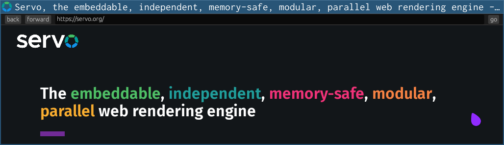

# The Servo Book

[_Servo_](https://servo.org) is a web browser engine written in the Rust programming language, and currently developed on 64-bit Linux, 64-bit macOS, 64-bit Windows, and Android.

Work is still ongoing to make Servo consumable as a webview library, so for now, the only supported way to use Servo is via _servoshell_, our [winit](https://crates.io/crates/winit)- and [egui](https://crates.io/crates/egui)-based example browser.

This book will be your guide to building and running servoshell, hacking on and contributing to Servo, the architecture of Servo, and how to consume Servo and its libraries.

**This book is still in early development!**
In the table of contents, \* denotes chapters that have been imported from our existing docs, and still need to be copyedited or reworked.
During this early stage of development, we’ll be frequently rewriting the Git history, so please be patient with us if you make a pull request.

## Need help?

Join the [Servo Zulip](https://servo.zulipchat.com) if you have any questions.
Everyone is welcome!
